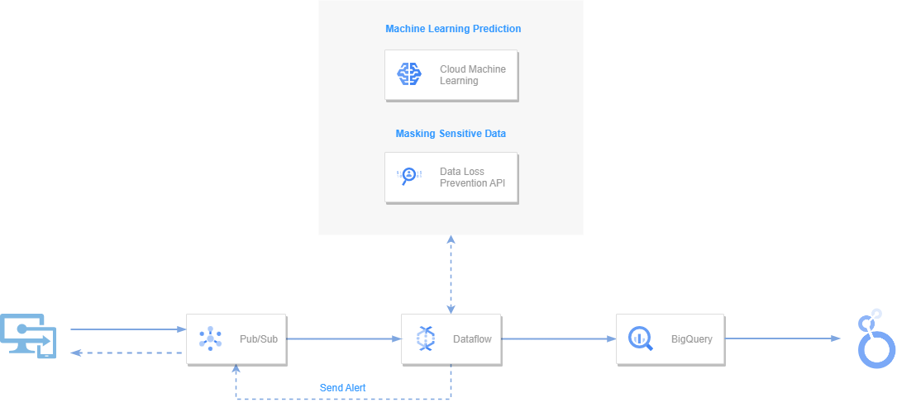
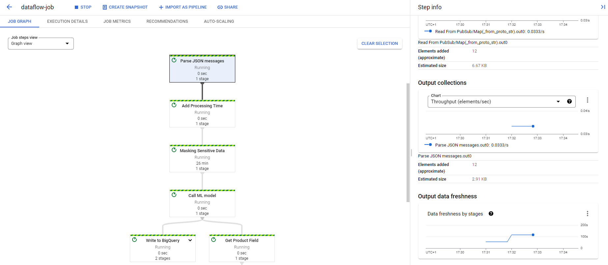
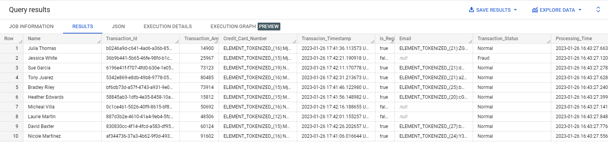

# Serverless real-time architecture
Serverless Data Processing | EDEM 2023

#### Case description
WallMart Data Engineering team we are part of has the objective of analyzing and processing the different banking transactions of its supermarkets. 

#### Business challenges

- Masking sensitive information about the transactions in order to prevent stakeholders from dealing with such data. (Bank Account Number, Customer Email, etc).
- For marketing purposes, we need to know the best_selling product every minute. **Extra**
- In addition, it must be determined whether the transaction is fraudulent or not.

#### Data Architecture


# Part 01: Serverless data processing with Dataflow

## Setup Requirements
- [Google Cloud Platform - Free trial](https://console.cloud.google.com/freetrial)
- [Install Cloud SDK](https://cloud.google.com/sdk/docs/install)
- Clone this **repo**
- For this Demo, we will be working **locally**.
- Run this command to authenticate yourself with your GCP account locally.
```
gcloud auth application-default login
```
- Enable required *Google Cloud APIs* by running the following commands:

```
gcloud services enable dataflow.googleapis.com
gcloud services enable cloudbuild.googleapis.com
```

- Create Python environment (Windows)
```
python -m venv <ENVIRONTMENT_NAME>
<ENVIRONMENT_NAME>\Scripts\activate.bat
```

- Create Python Environment (Mac)
```
python -m venv <ENVIRONTMENT_NAME>
source <ENVIRONMENT_NAME>/bin/activate
```
- Install python dependencies by running the followinw command:

```
pip install -U -r setup_dependencies.txt
```

## PubSub
First of all, we will create two **Topics** and their default **Subscriptions**.

- Go to Cloud Console [PubSub](https://console.cloud.google.com/cloudpubsub) page. 
- Click **Create Topic**, provide a unique topic name and check **add default subscription** option. 

Both Topics and subscriptions are needed in the following steps in order to create the Data pipeline.

## Cloud Storage

Go to Cloud Console [Cloud Storage](https://console.cloud.google.com/storage) page.

- Create a **bucket** specifying a global unique name. This bucket will be used to store both temp and staging files for the main Dataflow pipeline and the Dataflow Flex template in the extra exercise.

## BigQuery

- Go to Cloud Console [BigQuery](https://console.cloud.google.com/bigquery) page.
- Create a **BigQuery Dataset** by specifying EU as data location.
- Nothing else will be required as BigQuery table will be created by Dataflow Pipeline.

## Run Dataflow

- From **Local**
```
python edem_dataflow_streaming.py \
    --project_id <PROJECT_ID> \
    --hostname <HOSTNAME> \
    --input_subscription <INPUT_PUBSUB_SUBSCRIPTION> \
    --output_topic <OUTPUT_PUBSUB_TOPIC> \
    --output_bigquery <DATASET>.<TABLE>
```
- Run Pipeline in GCP: **Dataflow**
```
python edem_dataflow_streaming.py \
    --project_id <PROJECT_ID> \
    --hostname <HOSTNAME> \
    --input_subscription <INPUT_PUBSUB_SUBSCRIPTION> \
    --output_topic <OUTPUT_PUBSUB_TOPIC> \
    --output_bigquery <DATASET>.<TABLE> \
    --runner DataflowRunner \
    --job_name <YOUR_DATAFLOW_JOB> \
    --region <GCP_REGION> \
    --temp_location gs://<YOUR_PROJECT_ID>/tmp \
    --staging_location gs://<YOUR_PROJECT_ID/stg
```

- Run **Generator**

The generator will simulate the transactions that can be performed on the company's ecommerce site.

```
cd /02_Dataflow/00_Generator
python generator.py \
    --project_id <PROJECT_ID> \
    --topic_name <INPUT_PUBSUB_TOPIC>
```

- Dataflow graph


- Check results in BigQuery


# Extra: Run Dataflow with Flex Templates

- Go to [Dataflow folder](https://github.com/jabrio/Serverless_EDEM_2023/tree/main/02_Dataflow) and follow the instructions placed in **edemDataflow.py** file in order to processing the data by Beam pipeline.
- In this extra part, we will create a **Dataflow Flex Template**. More [info](https://cloud.google.com/dataflow/docs/guides/templates/using-flex-templates).
- You have the files needed in Dataflow_Flex_Template folder (*Dockerfile* and *requirements.txt*).
- [Package your python code into a Docker image](https://cloud.google.com/dataflow/docs/guides/templates/using-flex-templates#python_only_creating_and_building_a_container_image) and store it in Container Registry. You can do this by running the following command:

```
gcloud builds submit --tag 'gcr.io/<YOUR_PROJECT_ID>/<YOUR_FOLDER_NAME>/<YOUR_IMAGE_NAME>:latest' .
```
- [Create Dataflow Flex Template](https://cloud.google.com/dataflow/docs/guides/templates/using-flex-templates#creating_a_flex_template) from Docker image:

```
gcloud dataflow flex-template build "gs://<YOUR_BUCKET_NAME>/<YOUR_TEMPLATE_NAME>.json" \
  --image "gcr.io/<YOUR_PROJECT_ID>/<YOUR_FOLDER_NAME>/<YOUR_IMAGE_NAME>:latest" \
  --sdk-language "PYTHON" 
```

- Finally, run a [Dataflow job from template](https://cloud.google.com/dataflow/docs/guides/templates/using-flex-templates#running_a_flex_template_pipeline):

```
gcloud dataflow flex-template run "<YOUR_DATAFLOW_JOB_NAME>" \
    --template-file-gcs-location "gs://<YOUR_BUCKET_NAME>/<YOUR_TEMPLATE_NAME>.json" \
    --region "europe-west1" \
    --project_id <PROJECT_ID> \
    --hostname <HOSTNAME> \
    --input_subscription <INPUT_PUBSUB_SUBSCRIPTION> \
    --output_topic <OUTPUT_PUBSUB_TOPIC> \
    --output_bigquery <DATASET>.<TABLE>
```


