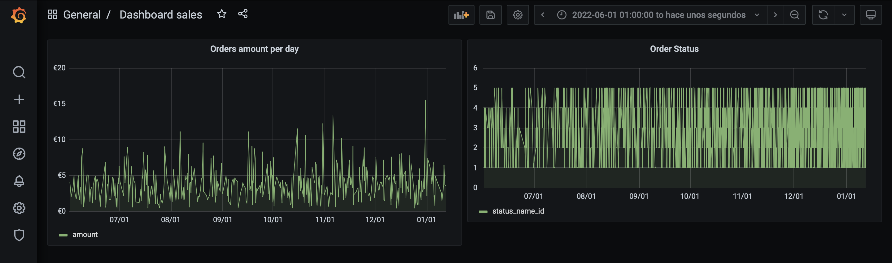

# Description

Ahora que ya tenemos datos, qué tal si hacemos alguna gráfica con ellos... ¿hay vida más allá de Tableau? 

Echádle un ojo a esto:

https://grafana.com/

¿Os atrevéis a arreglar el docker para montarlo? Sois capaces de crear una gráfica dentro de grafana? Ponedme una captura de pantalla del resultado.


## _Notas Miguel_

El usuario para entrar en Grafana es admin y la password es admin. En Grafana tenemos que añadir una nueva fuente de datos y seleccionar mySQL. En la siguiente imagen se muestra la configuración de parámetros:

<p align="center">

</p>

Dentro de grafana se han generado 2 gráficos, que se han incluido en el mismo Dashboard. El primero de ellos corresponde a la tabla ```sale``` e incluye 1000  ventas generadas aleatoriamente desde desde enero de 2022 a hoy. Se muestran solo ventas desde junio. En el segundo gráfico (el de la derecha) se ha intentado obtener un **left join** para unir las tablas order_status con status_name, de manera que se mostraran los nombres de los status_name en el eje Y, pero no ha sido posible (de momento) llegar a dicha solución.

<p align="center">

</p>