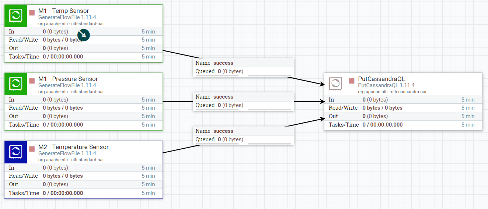
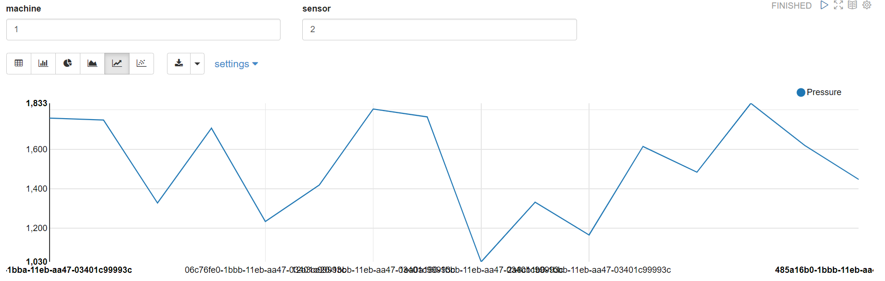

# Exercise 3: Inserting and reading data

## Initial setup

With the setup from the previous exercises should be enough to perform this exercise.
You will need:

* Apache NiFi running: https://localhost:8443/nifi
  * **Username**: admin
  * **Password**: ctsBtRBKHRAx69EqUghvvgEvjnaLjFEB
* Apache Zeppelin running: http://localhost:9999
* Cassandra running

## Exercise

In this exercise we will simulate a simple **IoT project**, gathering data using NiFi, storing it in Cassandra and run some basic queries in Zeppelin.

### Development

First we will create the table which will store the sensor data. This is the data we want to store:

* **Machine ID**: Identifies the machine we are gathering data from (there can be many)
* **Sensor ID**: Identifies which sensor (from a machine) is sending the data
* **Event Timestamp**: When the observation was made
* **Observation Type**: The metric we are measuring (e.g. Temperature, Pressure, Humidity...)
* **Observation Value**: The metric value

You can create the table using **Apache Zeppelin** or in the console using **CQLSH**.

Once the table is created, then we need to start inserting data. Given that we don't have machines or sensors, we will simulate it.

We will create a new workflow in **Apache NiFi** with just two processors:

* **GenerateFlowFile**: With this Processor you can reate a new FlowFile with an arbitrary text and then schedule it so it can run every "x" seconds. You can create as many as you want to simulate different sensors.
  * **TIP**: In the "Custom Text" property you can directly create the insert statement (if you later use PutCassandraQL)
  * **TIP**: Since we don't have sensor data, consider using the [random function](https://nifi.apache.org/docs/nifi-docs/html/expression-language-guide.html#random) in NiFi for the values.
* **PutCassandraXX**: This one inserts into Cassandra. Feel free to either use PutCassandraQL or PutCassandraRecord.
  * **TIP**: you will need to add the "CassandraSessionProvider" pointing to the database ("cassandra:9042"), under "Cassandra Contact Points".

At the end, your NiFi workflow should look something like this, but be creative:

Now that we are inserting data, let's query it. In **Apache Zeppelin**, we are going to create a simple dashboard to visualize machine and sensor data.

Create a new notebook, create a parametrized paragraph where you can select machine and sensor (e.g. `where machine_id = ${machine_id}` ...) and queries the table an collects the observations for the different metrics, visualizing it in a graph. 

The notebook should look something like this, but also be creative:

### Deliverables

Once the exericise is done, you should have the following:

* Cassandra table(s) DDL(s)
* NiFi workflow
* Zeppelin dashboard

We will discuss in the class what we have built and why.