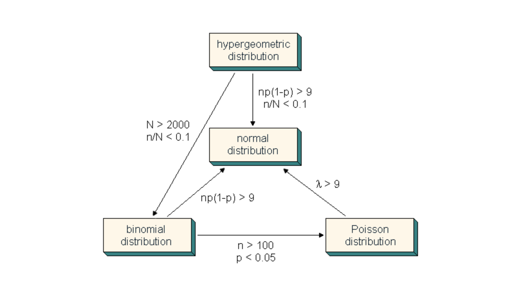

# Clase Estadística con Python

## _Clase 24-02-2023_

Estadística: Rama de las matemáticas encargada del estudio de los datos:
 - Recogida
 - Manipulación
 - Análisis
 - Inferencia
 - Interpretación

Principial objetivo: Obtener conclusiones para una población a través del estudio de un subconjunto de ella.

 

### Definiciones

Población: conjunto de todos los individuos de nuestro interés

Muestra: Subcojunto de la población. Tiene que ser representativa.

Parámetro: característica específica de la población. Calculada con datos poblaciones

Estadístico: caracterísitca espeífica de la muestra. Calculada con datos muestrales.

 

## Estadística descriptiva

Definición: La estadística descriptiva es la técnica matemática que obtiene, organiza, presenta y describe un conjunto de datos con el propósito de facilitar el uso. Estas técnicas son utilizadas en el proceso de investigación. Algunos ejemplos de estadística descriptiva son la distribución de frecuencias, la tendencia central y la variabilidad 

 

## Estadística Inferencial

Definición: En la estadística inferencial, se utilizan los resultados de los datos para hacer predicciones, obtener 
conclusiones y contribuir obtener información para la toma de decisiones.
 
 

## Variables aleatorias

Es una formalización matemática de una cantidad u objeto que depende de eventos aleatorios 

 

## Tipos de variables

- **Variables categóricas**: hay 2 tipos nominativas (nombran, etiquetan o categorizan atributos); ordinales (atributos con un orden en ellos)
- **Variables cuantitativas**: hay 2 tipos discretas (toman valores naturales) y continuas (pueden ser reducidas siempre a niveles más finos)

 

## Variables Categóricas

Frecuencia absoluta: las veces que aparece el dato en la muestra

Frecuencia relativa: la absoluta dividido por el total

Porcentaje: Frecuencia relativa x 100

Frecuencias acumuladas: acumulado de absolutas o relativas

 

## Variables cuantitativas

Tabla de frecuencia con intervalos

Histograma

 

## Medidas descriptivas univariantes

Hay números clave para describir los datos (estadísticos). Dada una muestra, queremos obtener información de ella a través de un estadístico adecuado.

### Medidas de tendencia central

Nos aydua a describir los valores centrales de la muestra (media, mediana y moda)

**Media**

$$\bar{x}=\frac{1}{n}\sum_{i=1}^{n}x_i=\frac{x_1 + x_2 + ... + x_n}{n}$$

La media poblacional se determina con el parámetro $\mu$

La media poblacional depende de la muestra, por lo que dependiendo de la muestra que cojamos nos va a dar un valor u otro.

Pros: es muy útil, usa todos los valores y es fácil de calcular

Cons: Outliers, variables no simétricas

**Mediana**

Dada una muestra ordenada, la mediana es el número que divide la muestra al 50%

Pros: no se ve alterada por distribuciones asimétricas o outliers

Cons: Más difícil de calcular, habitaulmente puede ser menos representativa de la media. Peor para tratar con ella matemáticamente. 

**Moda**

Es el valor que se encuentra con más frecuencia. Puede haber una, varias o ninguna

Pros: no se ve afectada por outliers y es muy informativa para datos categóricos

Cons: puede no haber moda, por lo tanto, poco informativa en algunos caso, puede no ser única.

 

### Medidas de posición

En este caso, las medidas siguientes nos darán información acerca de cómo está 
distribuida la muestra.
Nos indica la posición de un valor respecto al resto de datos.
Muy útil para describir conjuntos de datos grandes.

Medidas de posición más importantes: 

i) Percentiles

ii) Cuartiles

iii) Mínimo y Máximo

**Percentiles:**
Los percentiles separan la muestra en 100 intervalos con la misma cantidad de valores.

Los percentiles P25, P50 y P75 son los más interesantes.

**Cuartiles:**
Los cuartiles Q1, Q2 y Q3 son los percentiles 25, 50 y 75. 

Q1 y Q2 se conocen como primer y tercer cuartil, mientras que el Q2 es la mediana.

Los cuartiles separan nuestra muestra ordenada en 4 partes con las mismas observaciones.

 

### Medidas de dispersión

Estas medidas nos dan información sobre la variabilidad de nuestros datos: 

i) Rango: El rango es la diferencia entre el máximo y el mínimo
El rango intercuartílico es la diferencia entre el Q3 y el Q1

ii) Rango Intercuartílico: Es la media de los cuadrados de las desviaciones de la media con los valores.

iii) Varianza: Es la media de los cuadrados de las desviaciones de la media con los valores.

$$\sigma^2 = \frac{1}{n} \sum_{i=1}^n (x_i - \mu)^2$$

iv) Desviación típica: Es la raíz cuadrada positiva de la varianza. es la medida más utilizada por su fácil 
interpretación.

$$\sigma = \sqrt{\frac{1}{n} \sum_{i=1}^n (x_i - \mu)^2}$$

v) Coeficiente de variación: Esta medida representa la variabilidad de los datos respecto a la media.

$$\mathrm{C.V.}=\frac{S}{\bar{x}}\cdot 100$$

 

### Medidas de forma de una distribución

Gráficamente, podemos describir la forma de una distribución usando un histograma.

El objetivo es visualizar si los datos están idénticamente distribuidos desde el centro de la muestra.

Simetría:

Decimos que una que la forma de una distribución es simétrica cuando las observaciones están cercanamente equilibradas respecto al centro.

Asimetría (skewness) cuando los datos no son simétricos. Hay dos tipos de asimetría

 

### Descriptiva bivariante

Hasta ahora sólo hemos utilizado descriptiva univariante. De ahora en adelante, consideramos dos variables X e Y del mismo tipo: cuantitativas continuas.

En este caso, vamos a estudiar dos medidas muy utilizadas: 
 
**Covarianza**: Mide la potencia (en términos lineales) de la 
relación entre dos variables. Distinguimos dos tipos

$$\sigma_{xy} = \frac{1}{n} \sum_{i=1}^n (x_i - \bar{x})(y_i - \bar{y})$$

Que salgan valores altos o bajos no quiere decir que la relación sea fuerte o débil. Para ello, utilizamos el coeficiente de correlación.
  
Interpretación de la covarianza:

- Si la covarianza es positiva, la relación entre las variables es directa.
- Si la covarianza es negativa, la relación entre las variables es inversa.
- Si la covarianza es 0, no hay relación lineal entre las variables.

**Coeficiente de correlación**: Mide la relación lineal entre dos variables. 

Ambas medidas se utilizarán para ver el grado de relación lineal que tienen ambas variables

**Coeficiente de corelacion de Pearson**: Es el coeficiente de correlación más utilizado. Mide la relación lineal entre dos variables cuantitativas continuas.

Fórmula de Pearson: 
$$r_{xy} = \frac{\sigma_{xy}}{\sigma_x \sigma_y}$$

Propiedades de Pearson:
- Cuanto más cerca de -1, más fuerte es la relación inversa entre las variables.
- Cuanto más cerca de 1, más fuerte es la relación directa entre las variables.
- Cuanto más cerca de 0, más débil es la relación entre las variables.

 

 

## _Clase 25-02-2023_

 

### Función de probabilidad

La función de probabilidad es una función que nos permite calcular la probabilidad de que ocurra un evento y verifica que:

1. La probabilidad de que ocurra un evento es un número entre 0 y 1. 
   $$0 <= P(A) <= 1$$

2. Para cualquier evento, la probabilidad de que ocurra es 1.
   
   $$P(\Omega) = 1$$

3. Si dos eventos son mutuamente excluyentes, la probabilidad de que ocurra uno de ellos es la suma de las probabilidades de que ocurran ambos.

### Función de distribución

La función de distribución es una función que nos permite calcular la probabilidad de que ocurra un evento y verifica que:

$$F(x) = P(X \leq x)$$

Si $X$ es una variable aleatoria continua, entonces la función de distribución es la integral acumulada de la función de densidad de probabilidad.

$$F(x) = \int_{-\infty}^x f(x) dx$$

La función de densidad describe la probabilidad de que la variable aleatoria tome un valor en un intervalo dado.

$$f(x) = \frac{dF(x)}{dx}$$

 

### Distribuciones discretas

Las distribuciones discretas son aquellas en las que la variable aleatoria puede tomar un número finito o infinito de valores.

**Tipos de distribuciones discretas**

- Distribución de Bernoulli: Es la distribución de probabilidad de una variable aleatoria binaria.

$$P(X = x) = p^x(1-p)^{1-x}$$

La esperanza matemática de una variable aleatoria binaria es: $E(X) = p$

La varianza de una variable aleatoria binaria es: $Var(X) = p(1-p)$

 

- Distribución binomial: Es la distribución de probabilidad de la suma de n variables aleatorias binarias.

$$P(X = x) = \binom{n}{x}p^x(1-p)^{n-x}$$

Esperanza: $E(X) = np$

Varianza: $Var(X) = np(1-p)$

 

- Distribución de Poisson: Es la distribución de probabilidad de la ocurrencia de un evento en un intervalo de tiempo o espacio.

$$P(X = x) = \frac{\lambda^x e^{-\lambda}}{x!}$$

$$\lambda = \frac{\mu \sigma^2}{\mu^2}$$

Esperanza: $E(X) = \lambda$

Variación: $Var(X) = \lambda$

 

- Distribución Geométrica: Es la distribución de probabilidad de la ocurrencia del primer éxito en una secuencia de ensayos independientes.
  
- Distribución Uniforme: Es la distribución de probabilidad de una variable aleatoria discreta que toma valores en un intervalo cerrado.

$$P(X = x) = \frac{1}{b-a+1}$$

Esperanza: $E(X) = \frac{a+b}{2}$

Varianza: $Var(X) = \frac{(b-a+1)^2-1}{12}$

 

**Tiops de distribuciones continuas**

- Distribución normal: Es la distribución de probabilidad de una variable aleatoria continua que sigue una distribución normal.

$$f(x) = \frac{1}{\sigma \sqrt{2\pi}} e^{-\frac{(x-\mu)^2}{2\sigma^2}}$$

Esperanza: $E(X) = \mu$

Varianza: $Var(X) = \sigma^2$

**Teorema central del límite**

Si $X_1, X_2, ..., X_n$ son variables aleatorias independientes e idénticamente distribuidas, entonces la variable aleatoria:

$$\bar{X} = \frac{X_1 + X_2 + ... + X_n}{n}$$
$$\sqrt{n}(\bar{X} - \mu) \xrightarrow[n \rightarrow \infty]{} N(0, \sigma^2)$$

Si $X$ no es normal, pero $n$ es suficientemente grande, entonces $\bar{X}$ es normal.

 

- Distribución chi-cuadrado: Es la distribución de probabilidad de la suma de cuadrados de n variables aleatorias normales.

$$f(x) = \frac{1}{2^{\nu/2}\Gamma(\nu/2)} x^{\nu/2-1} e^{-x/2}$$

Esperanza: $E(X) = \nu$

Varianza: $Var(X) = 2\nu$

Grados de libertad: $\nu = n-1$. 

 

- Distribución t de Student: Es la distribución de probabilidad de la media de n variables aleatorias normales.

$$f(x) = \frac{\Gamma((\nu+1)/2)}{\sqrt{\nu\pi}\Gamma(\nu/2)} \left(1+\frac{x^2}{\nu}\right)^{-(\nu+1)/2}$$

Esperanza: $E(X) = 0$

Varianza: $Var(X) = \frac{\nu}{\nu-2}$. Para $\nu > 2$.

 

- Distribución F de Fisher: Es la distribución de probabilidad de la razón de dos variables aleatorias chi-cuadrado.

$$f(x) = \frac{\Gamma(\frac{\nu_1+\nu_2}{2})}{\Gamma(\frac{\nu_1}{2})\Gamma(\frac{\nu_2}{2})} \left(\frac{\nu_1}{\nu_2}\right)^{\frac{\nu_1}{2}} x^{\frac{\nu_1}{2}-1} \left(1+\frac{\nu_1}{\nu_2}x\right)^{-\frac{\nu_1+\nu_2}{2}}$$

Esperanza: $E(X) = \frac{\nu_2}{\nu_2-2}$. Para $\nu_2 > 2$.

Varianza: $Var(X) = \frac{2\nu_2^2(\nu_1+\nu_2-2)}{\nu_1(\nu_2-2)^2(\nu_2-4)}$. Para $\nu_2 > 4$.

 

**Relación entre distribuciones**

