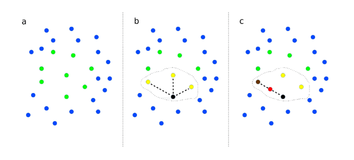
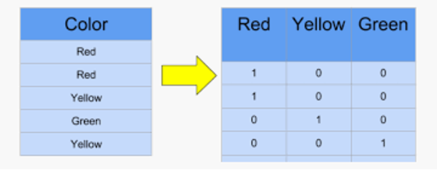
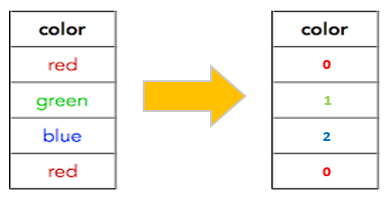
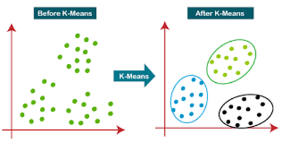
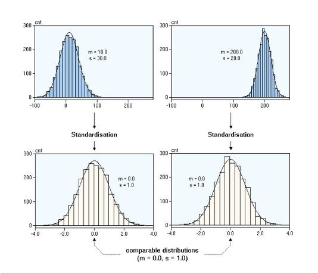
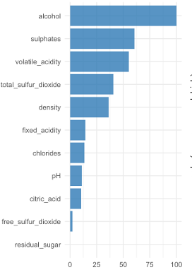

# Notas sobre Data Preprocessing

Data preprocessing son operaciones analíticas para preparar los datos para su uso como input de un modelo de ML.

## Oversampling y subsampling

Un problema desbalanceado es aquel en el que las clases a predecir tienen ratios muy desiguales. Por ejemplo: fraude (0.16%) vs no fraude (99.84%). En este caso, el modelo tiende a predecir la clase mayoritaria, lo que no es deseable.

Los problemas desbalanceados suponen una problemática adicional para los modelos de ML.

Para disminuir el problema, muchas veces se recurre a una combinación de dos pasos:

- Submuestreo de la clase mayoritaria: aleatorio o eliminando casos menos relevantes.

- Sobremuestreo de la clase minoritaria: aleatorio o creando datos sintéticos. Existen varias técnicas: SMOTE (datos estructurados), GANS (imágenes), etc.

### SMOTE

Busca crear datos sintéticos de la clase minoritaria. Solo se emplea si el dataset tiene datos estructurados.

Algoritmo: 

1. Establecer un número de vecinos a analizar (K). Por ejemplo, K=3
2. Elegir aleatoriamente una observación, p, de la clase minoritaria.
3. Calcular los K vecinos más próximos de p.
4. Elegir aleatoriamente uno de estos K vecinos $p_k$
5. Calcular aleatoriamente un punto entre p y $p_k$ y añadirlo al dataset.

 

 

## Eliminar Variables No Informadas

El algunos casos tendremos variables con un elevadísimo númoer de valores no informados. Estos valores se pueden rellenar de diferentes formas.

No obstante, si hay demasiados missing values, la mejor opción es eliminar la variable del dataset.

Se recomienda ser conservador, sobre todo en el caso de problemas desbalanceados.

 

 

## Rellenar Missing Values

La mayoría de los modelos de aprendizaje automático no aceptan valores no informados. 

Por ello, si después de hacer el data cleaning y eliminar variables no informadas, todavía existen valores no informados, es necesario inferirlos.

Varias opciones:

0. Tratar los valores categóricos no informados como una nueva categoría.
1. Sustituir por media/moda: este método reduce la complejidad computacional y es fácil de implementar. A veces es demasiado básico, especialmente cuando el volumen de valores no informados es alto.
2. Predecir mediante ML: crear un modelo de ML para cada variable con el fin de estimar los valores que faltan. Es computacionalmente complejo
3. Imputación multivariante. MICE / estimación de máxima verosimilitud, MLE: este método está implementado en R y Python. Es computacionalmente complejo. MICE requiera valores no informado no MCAR (missing completely at random).

 

 

## One hot encoding

A veces también se llama dummy encoding. La mayoría de los modelos de aprendizaje automático no aceptan variables categóricas como input. Tienen que ser transormadas en variables numéricas. No hay que confundir con label encoding

No debe confundirse con label encoding:

 

 

## Agrupar categorías

Podemos encontrarnos con variables categóricas con un alto elevado de categorías

En este caso puede ser recomendable agrupar algunas de las mismas para reducir la dimensionalidad.

Heurísticas para realizar esta agrupación:

Clustering: Dendograma, k-mean

 

 

## Escalado

Varios modelos de Machine Learning utilizan distancias, donde la escala tiene un gran impacto.

Esto puede hacer que el modelo se centre más en variables con una escala más alta.

Por esta razón, normalmente tlas variables del conjunto de datos se escalan de alguna maenra. La opción más popular es escalar a media cero y desviación estándar 1.

 

 

## Correlación. Redundancia/Irrelevancia

Basado en que variables altamente correlacionadas tienen información similar

- Eliminar varaibles redundatnes: variables predictoras con una correlación con otras variables predictoras superior a un unmbral particular. Las variables redundantes pueden causar problemas en los modelos de ML, y en cualquier caso suponen un coste computacional extra, por lo que solo se debe mantener una.

- Eliminar variables irrelevantes: variables predictoras con una correlación con el target inferior a un umbral particular, por ejemplo. Las variables irrelevantes se pueden eliminar del modelo de ML para reducir la dimensionalidad

 

 

## Importancia de variable

Objetivo: calcular una puntuación de importancia para cada uno de las variables de entrada. Permite seleccionar un subconjunto de variables en función de su importancia.

La puntuación de importancia dependerá del target a predecir. 

 

 

## Modelos univariantes

La idea es entrenar un modelo univariado para predecir el target con cada una de las variables disponibles.

Por lo general, se aplica un modelo básico. Se miden los errores de predicción sobre el conjunto de test para cada modelo.

Las variables con menor error de predicción reciben una puntuación de mayor importancia.

 

 

## Weighting

En algunos casos puede ocurrir que estemos más intersados en acertar laaws predicciones sobre una clase concreta. 

Por ejemplo, si queremos estimar la prognosis de un paciente, quizá nuestro foco está en los casos que puedan terminar en fallecimiento.

Varias opciones:

- Sobremuestreo: de la clase de mayor relevancia.

- Métrica personalizada: que penalice más los errores en esta clase.

- Weighting: indicar el modelo que durante su entrenamiento estas observaciones deben tener más peso.

