# Notas adicionales Machine Learning

## Cleaning vs preprocessing

Aunque comparten similitudes, normalmente son fases independientes

- Data cleaning es un paso previo al de data preprocessing
- Data cleaning son operaciones genéricas de limpieza de datos, no necesariamente orientadas a aplicar ML. (**Puede ser para ML o no**)
- Data preprocessing son operaciones analíticas para preparar los datos para su uso como input de un modelo de ML(**Para ML si o si**)

## Exploratory Data Analysis (EDA)

Es un proceso iterativo de exploración de datos, que permite entender mejor los datos y su relación con el problema a resolver.

### Intuición

Enfoque para analizar conjuntos de datos para resumir sus características principales, a menudo con métodos visuales.

Dos objetivos:

- Ver lo que nos pueden decir los datos antes de la tarea de modelado
- Primer paso de limipeza (data cleaning) antes de la etapa de modelado.

### Steps

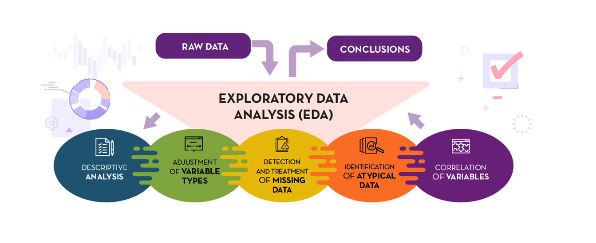

 

## Análisis descriptivo

Objetivo: resumir la información más relevante con respecto a los datos disponibles, proporcionando información sin tener que explorar manualmente los datos y antes de llevar a cabo pasos de preprocesamiento o análisis más complejos.

Hay dos componentes principales:

- Estadísticos
- Visualizaciones

### Estadísticos

**Variables numéricas:**
- Media
- Mínimo y máximo
- Cuartiles/percentiles

**Variables categóricas:**
- Moda
- Número de categorías
- Tabla de frecuencias

 

### Visualizaciones

#### **VARIABLES NUMÉRICAS**

- Scatter plot

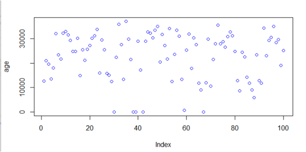

- Line plot

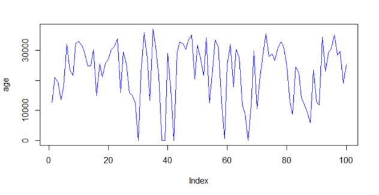

- Histograma

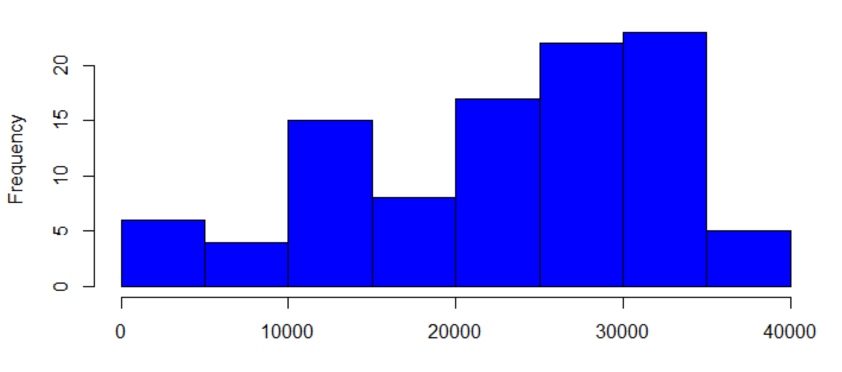

- Box plot

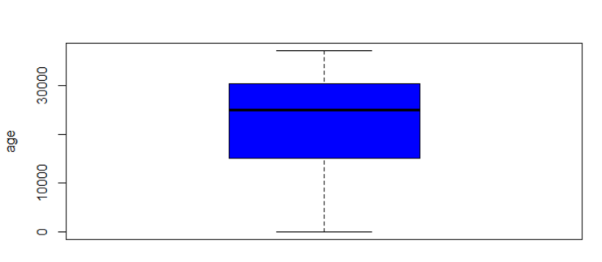

- Función de densidad

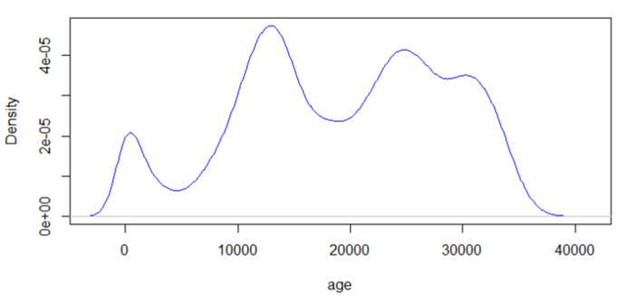

- Funcion de distribucion

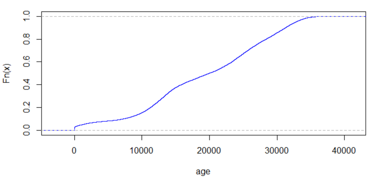

 

 

#### **VARIABLES CATEGÓRICAS**

- Bar plot

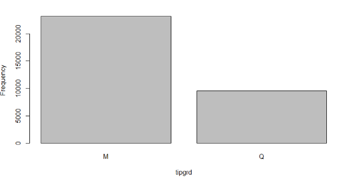

- Pie chart

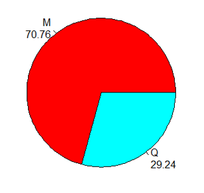

- Line plot

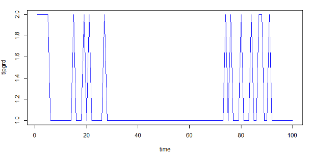

- Scatter plot

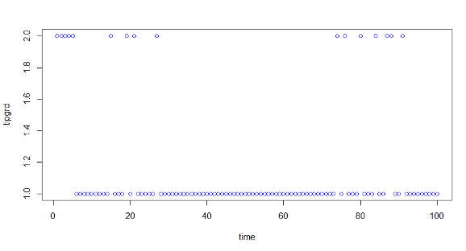

 

 

## Variables numéricas

- Integer: un número entero (no un número fraccionario) que puede ser positivo, negativo o cero. Ejemplo: -1, 5, 0, -5

- Float: un número de punto flotante, es decir, un número que tiene valores decimales. Ejemplo: 1.0, 3.14, -2.5

Se clasifican además en variables discretas y continuas:

- Discretas: son aquellas que pueden tomar un número finito de valores. Ejemplo: número de hijos, número de hermanos, número de personas en una casa, etc.

- Continuas: son aquellas que pueden tomar un número infinito de valores. Ejemplo: altura, peso, temperatura, etc.

## Variables categóricas

- String: una secuencia de caracteres. Ejemplo: "hola", "adiós", "hasta luego"

- Boolean: un valor que puede ser verdadero o falso. Ejemplo: True, False.

Se clasifican además en variables ordinales y nominales:

- Ordinales: son aquellas que tienen un orden. Ejemplo: tallas de ropa, calificaciones de 1 a 5, etc.

- Nominales: son aquellas que no tienen un orden. Ejemplo: colores, géneros, etc.

 

 

## Missing values. Detectar y unificar

Los valores no informados pueden distorsionar el análisis. Debemos llevar a cabo algunos pasos para detectarlos y unificarlos.

1. Detectar: numpy.isnan(), pandas.isnull(), pandas.DataFrame.isna(), pandas.info
2. Unificas: los valores no informados a veces no se representan en el formato estándar. Las opciones son : NA, NaN, NULL, "", " ", "NA", "NaN", "NULL", etc.
3. Reemplazar: A veces los valores que faltan tienen un "significado". Estos missing values deben reemplazarse manualmente con un valor adecuado. Por ejemplo, si falta el valor de días de ingreso en UCI cuando no hay estancia en UCI, sustituir por un 0. Si falta el valor de la IP puede significar que la IP está oculta, sustituir por "Hidden".

## Detección de outliers

- Boxplot: los gráficos de diagramas de caja generalmente permiten visualizar los valores atípicos en un conjunto de datos. Los valores atípicos son aquellos que se encuentran fuera de los límites superior e inferior del diagrama de caja.

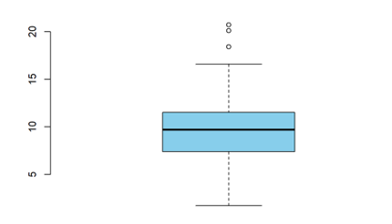

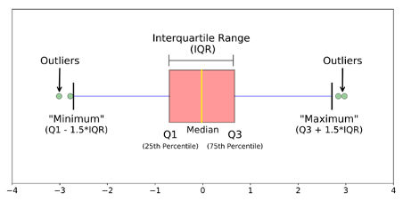

- Distribución: se pueden detectar datos anómalos mirando las colas de la función de densidad:

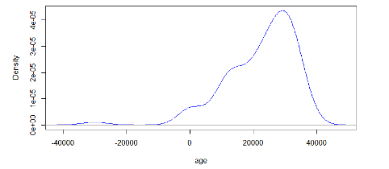

- Estadísticos: analizar los valores mínimos y máximos a veces es suficinete para detectar valores atípicos. Por ejemplo, si el valor mínimo es 0 y el valor máximo es 100, pero el valor medio es 80, es posible que haya un valor atípico.

## Acciones con los outliers

Es importante diferenciar entre valores atípicos reales y datos erróneos.

1. Datos erróneos: por ejemplo edades negativas. si los outliers son datos erróneos se pueden tomar las siguientes acciones:

- Quitar filas. No se recomienda si el volumen de datos erróneos es significativo.
- Tratarlos como valores no informados
- "Clippear" valores a un cierto rango razonable. Por ejemplo, si el valor máximo es 100, sustituir los valores mayores que 100 por 100.
- Contactar con origen de los datos para tratar de resolver el problema.

2. Outliers reales: por ejemplo edad igual a 140 años. Estos son datos válidos. Sin embargo, estos valores extremos pueden distorsionar el análisis. Posibles acciones que se pueden tomar:

- Quitar filas. No se recomienda si el volumen de outliers es significativo o los casos podrían ser importantes.
- Clippear valores a un rango razonable

 

 

## Correlación

Grado en que un par de variables están linealmente relacionadas. Puede tomar los siguientes valores:

- r cerca de 1: variables con alta correlación positiva (si una variable aumenta, la otra también aumenta)
- r cerca de -1: variables con alta correlación negativa (si una variable aumenta, la otra disminuye)
- r cerca de 0: variables independientes entre si

Nos sirve para indicar con qué facilidad se explica una variable en función de la combinación lineal de otras 

$$ x_1 = A\cdot x_2 $$

Fórmula para la correlación entre 2 variables:

$$ r = \frac{\sum_{i=1}^{n} (x_i - \bar{x})(y_i - \bar{y})}{\sqrt{\sum_{i=1}^{n} (x_i - \bar{x})^2}\sqrt{\sum_{i=1}^{n} (y_i - \bar{y})^2}} $$

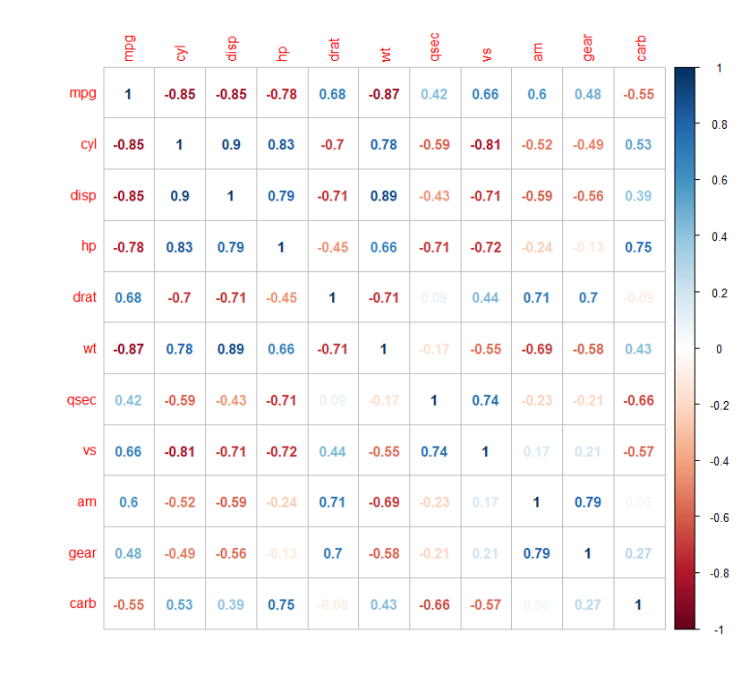