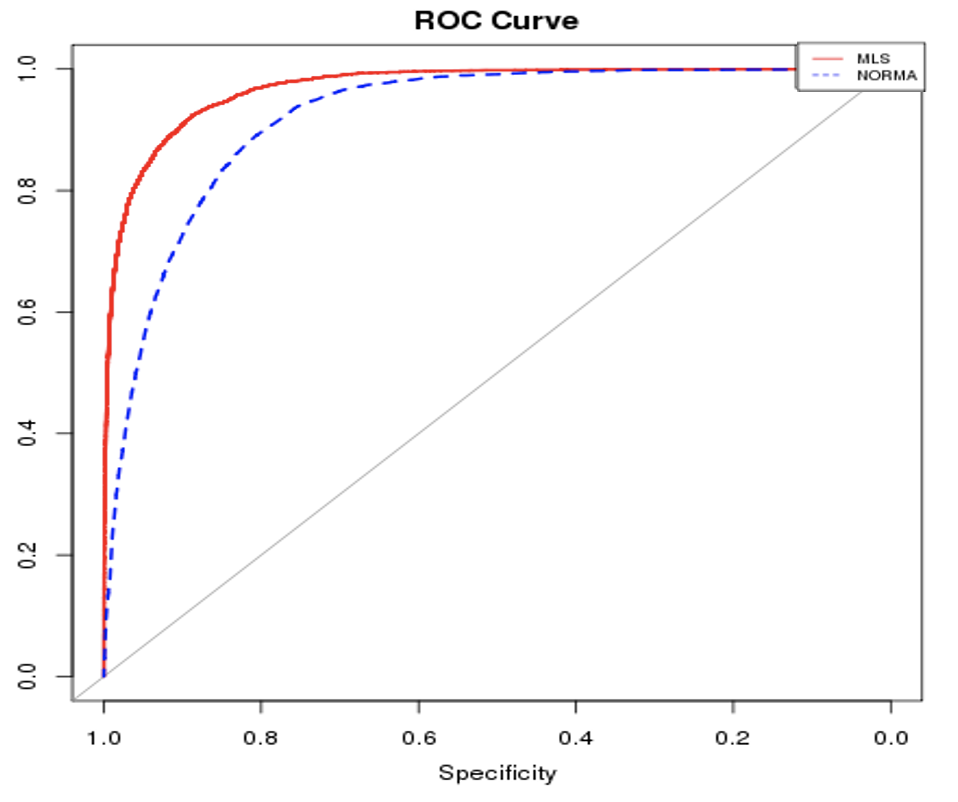

# Introducción a Machine Learning

¿Qué es Machine Learning?

Machine Learning es un campo de la inteligencia artificial que le da a las computadoras la capacidad de aprender sin ser explícitamente programadas. 

Ejemplos:

- Netflix: recomendación de películas es un ejemplo de machine learning.

- Coche autónomo: el coche autónomo es un ejemplo de machine learning.

Hay tres ramas que  cubren machine learning:

- Computer Science: es la rama que se encarga de la teoría de machine learning.

- Business Knowledge: es la rama que se encarga de la aplicación de machine learning.

- Statistics and Maths: es la rama que se encarga de la estadística y la matemática de machine learning.

 

 

## Estructura proyecto ML

Paso previo - Plantear un problema o hipótesis a demostrar.

Paso 1 - Recopilar datos y limpiarlos. 

Paso 2 - Preparar los datos para el modelo.

Paso 3 - Entrenar el modelo.

Paso 4 - Evaluar el modelo.

Paso 5 - Optimizar el modelo.

Paso 6 - Presentar el modelo.

Paso 7 - Desplegar el modelo.

Paso 8 - Mantener el modelo.

 

 

## Ejemplo ML

Ejemplo de un problema de machine learning: 

### Train

Conjunto de imágenes de gatos y mujeres. A las imágenes de gatos se les etiqueta como 1 y a las imágenes de mujeres se les etiqueta como 0. 

### Test

Se prueba el modelo entrenado con nuevas imagenes en las que algunas son de gatos, otras de mujeres y otras de cosas que no son ni gatos ni mujeres, y se comprueba en cuales de las imágenes etiqueta correctamente y en cuales no. Si alguna de las imágenes se etiqueta como gato y no lo es se llama overfitting. 

 

 

## _Clase 10-03-2023_

 

## Cleaning vs preprocessing

Aunque compartan el mismo objetivo, cleaning y preprocessing son dos conceptos diferentes. 

### Cleaning

Cleaning es el proceso de limpiar los datos. 

### Preprocessing

Preprocessing es el proceso de preparar los datos para el modelo.

Diferencias:

- Cleaning: se hace antes de preprocessing.
  
- Preprocessing: se hace después de cleaning.

- Cleaning: se hace una vez.

- Preprocessing: se hace varias veces.

- Cleaning: se hace con el conjunto de datos completo.

- Preprocessing: se hace con el conjunto de datos de entrenamiento.

 

## Pasos del proceso de machine learning

### Establecer el objetivo

El objetivo es la variable que queremos predecir. 

Ejemplo:

- Si queremos predecir si un paciente tiene o no diabetes, el objetivo es la variable diabetes.

### Selección de variables

Las variables son las características que se usan para predecir el objetivo. 

Ejemplo:

- Si queremos predecir si un paciente tiene o no diabetes, las variables son la edad, el sexo, el índice de masa corporal, la presión arterial, etc.

### Oversampling

Oversampling es el proceso de aumentar el número de muestras de la clase minoritaria.

Ejemplo:

- Si queremos predecir si un paciente tiene o no diabetes, y tenemos 1000 pacientes con diabetes y 100 pacientes sin diabetes, el oversampling consiste en aumentar el número de pacientes sin diabetes hasta tener 1000 pacientes sin diabetes.

### Undersampling

Undersampling es el proceso de reducir el número de muestras de la clase mayoritaria.

Ejemplo:

- Si queremos predecir si un paciente tiene o no diabetes, y tenemos 1000 pacientes con diabetes y 100 pacientes sin diabetes, el undersampling consiste en reducir el número de pacientes con diabetes hasta tener 100 pacientes con diabetes.

### Eliminar variables constantes

Eliminar variables constantes es el proceso de eliminar las variables que tienen el mismo valor para todas las muestras.

Ejemplo:

- Si queremos predecir si un paciente tiene o no diabetes, y tenemos 1000 pacientes con diabetes y 100 pacientes sin diabetes, y todas las muestras tienen el mismo valor para la variable sexo, se puede eliminar la variable sexo.

### Rellenar valores faltantes

Rellenar valores faltantes es el proceso de rellenar los valores faltantes de las variables.

Ejemplo:

- Si queremos predecir si un paciente tiene o no diabetes, y tenemos 1000 pacientes con diabetes y 100 pacientes sin diabetes, y algunas muestras tienen valores faltantes para la variable sexo, se puede rellenar esos valores faltantes con el valor más frecuente de la variable sexo.

### Agrupar categorías

Agrupar categorías es el proceso de agrupar las categorías de las variables categóricas.

Ejemplo:

- Si queremos predecir si un paciente tiene o no diabetes, y tenemos 1000 pacientes con diabetes y 100 pacientes sin diabetes, y la variable sexo tiene las categorías masculino y femenino, se puede agrupar las categorías en una sola categoría llamada sexo.

### Codificar variables categóricas

Codificar variables categóricas es el proceso de convertir las variables categóricas en variables numéricas.

Ejemplo:

- Si queremos predecir si un paciente tiene o no diabetes, y tenemos 1000 pacientes con diabetes y 100 pacientes sin diabetes, y la variable sexo tiene las categorías masculino y femenino, se puede codificar las categorías como 0 y 1.

### Escalar variables

Escalar variables es el proceso de transformar las variables numéricas para que todas ellas tengan el mismo rango de valores.

Ejemplo:

- Si queremos predecir si un paciente tiene o no diabetes, y tenemos 1000 pacientes con diabetes y 100 pacientes sin diabetes, y las variables edad y índice de masa corporal tienen rangos de valores muy diferentes, se puede escalar las variables para que todas ellas tengan el mismo rango de valores.

### Separar conjunto de datos en conjunto de entrenamiento y conjunto de prueba

Separar conjunto de datos en conjunto de entrenamiento y conjunto de prueba es el proceso de separar el conjunto de datos en dos conjuntos, uno para entrenar el modelo y otro para probarlo.

Ejemplo:

- Si queremos predecir si un paciente tiene o no diabetes, y tenemos 1000 pacientes con diabetes y 100 pacientes sin diabetes, se puede separar el conjunto de datos en un conjunto de entrenamiento con 900 pacientes y un conjunto de prueba con 100 pacientes.

 

 

## Oversampling y undersampling

Un problema desbalanceado es aquel en el que las clases a predecir tienen ratios muy desiguales.  

Ejemplo:

- Si queremos predecir si un paciente tiene o no diabetes, y tenemos 1000 pacientes con diabetes y 100 pacientes sin diabetes, el problema es desbalanceado porque la clase con diabetes tiene 10 veces más muestras que la clase sin diabetes.

Los problemas desbalanceados suponen una problemática adicional para los modelos de ML porque los modelos tienden a predecir la clase mayoritaria.

Para disminuir el problema, muchas vece se recurre a una combinación de dos pasos:

- Undersampling: reducir el número de muestras de la clase mayoritaria. Puede ser aleatorio o estratificado.

- Oversampling: aumentar el número de muestras de la clase minoritaria. Puede ser aleatorio o estratificado. Puede ser SMOTE o ADASYN.

### SMOTE

SMOTE es una técnica de oversampling que consiste en generar muestras sintéticas de la clase minoritaria. Se emplea un algoritmo de clustering para generar muestras sintéticas de la clase minoritaria. Se usa cuando el dataset tiene datos estructurados

Algorigmo: 

- Seleccionar una muestra de la clase minoritaria.

- Elegir una de sus k vecinas más cercanas.

- Calcular los K vecinos más cercanos de la muestra elegida.

- Elegir aleatoriamente uno de los K vecinos.

## Eliminar variables No informadas

Eliminar variables No informadas es el proceso de eliminar las variables que tienen un porcentaje de valores faltantes superior a un umbral.

Los valores no informados pueden rellenarse de distintas formas. Sin embargo, si el porcentaje de missing values es muy alto, puede ser mejor opción eliminar la variable del dataset.

Es recomendable ser conservador, sobre todo en el caso de problemas desbalanceados. En estos casos, es mejor eliminar variables que rellenar valores faltantes.

## Rellenar missing values

Rellenar missing values es el proceso de rellenar los valores faltantes de las variables. La mayoría de los algoritmos de ML no pueden trabajar con valores faltantes, por lo que es necesario rellenarlos. La única excepción son los modelos de árboles de decisión, que pueden trabajar con valores faltantes.

Si después del data cleaning y de eliminar variables no informadas aún existen valores no informados, deben inferirse.

Existen distintas formas de rellenar los valores faltantes:

- Rellenar con el valor más frecuente de la variable.
- Rellenar con el valor medio de la variable.
- Rellenar con el valor mediano de la variable.
- Rellenar con el valor más cercano de la variable.
- Rellenar con el valor más cercano de la variable, pero solo si la distancia es menor a un umbral.

## One hot enconding

One hot enconding es el proceso de convertir las variables categóricas en variables numéricas. La mayoría de los algoritmos de ML no pueden trabajar con variables categóricas, por lo que es necesario convertirlas en variables numéricas.

## Escalado

Escalar variables es el proceso de transformar las variables numéricas para que todas ellas tengan el mismo rango de valores. La mayoría de los algoritmos de ML no pueden trabajar con variables numéricas con rangos de valores muy diferentes, por lo que es necesario escalarlas.

Existen distintas formas de escalar las variables:

- Escalado min-max: transforma los valores de las variables a un rango de valores entre 0 y 1.

- Escalado estandar: transforma los valores de las variables a un rango de valores entre -1 y 1.

- Escalado robusto: transforma los valores de las variables a un rango de valores entre 0 y 1, pero usando el rango intercuartil en lugar del rango de valores de la variable.

- Escalado normal: transforma los valores de las variables a un rango de valores entre 0 y 1, pero usando la media y la desviación estándar en lugar del rango de valores de la variable.

- Escalado logarítmico: transforma los valores de las variables a un rango de valores entre 0 y 1, pero usando el logaritmo en lugar del valor de la variable.

- Escalado raíz cuadrada: transforma los valores de las variables a un rango de valores entre 0 y 1, pero usando la raíz cuadrada en lugar del valor de la variable.

## Eliminar variables irrelevantes

Eliminar variables irrelevantes es el proceso de eliminar las variables que no aportan información al modelo. La mayoría de los algoritmos de ML no pueden trabajar con variables irrelevantes, por lo que es necesario eliminarlas.

## Eliminar variables redundantes

Eliminar variables redundantes es el proceso de eliminar las variables que son redundantes con otras variables. La mayoría de los algoritmos de ML no pueden trabajar con variables redundantes, por lo que es necesario eliminarlas.

Existen distintas formas de eliminar variables redundantes:

- Eliminar variables con alta correlación entre ellas.

- Eliminar variables con alta correlación con la variable objetivo.

- Eliminar variables con alta correlación con otras variables.

- Eliminar variables con alta correlación con otras variables, pero solo si la correlación es mayor a un umbral.

## Variable Importance

Variable importance es el proceso de calcular la importancia de las variables para el modelo. La mayoría de los algoritmos de ML no pueden calcular la importancia de las variables, por lo que es necesario calcularla de forma manual.

Existen distintas formas de calcular la importancia de las variables:

- Eliminar variables y calcular el error del modelo.

- Eliminar variables y calcular el error del modelo, pero solo si el error del modelo es mayor a un umbral.

- Eliminar variables y calcular el error del modelo, pero solo si el error del modelo es mayor a un umbral y el número de variables es menor a un umbral.

- Eliminar variables y calcular el error del modelo, pero solo si el error del modelo es mayor a un umbral y el número de variables es menor a un umbral y el número de variables es mayor a un umbral.

## Weighting

Weighting es el proceso de asignar pesos a las muestras de las clases para compensar el desbalanceo. La mayoría de los algoritmos de ML no pueden trabajar con problemas desbalanceados, por lo que es necesario asignar pesos a las muestras de las clases.

Existen distintas formas de asignar pesos a las muestras de las clases:

- Asignar pesos a las muestras de las clases en función del número de muestras de cada clase.

- Asignar pesos a las muestras de las clases en función del número de muestras de cada clase, pero solo si el número de muestras de la clase mayoritaria es mayor a un umbral.

- Asignar pesos a las muestras de las clases en función del número de muestras de cada clase, pero solo si el número de muestras de la clase mayoritaria es mayor a un umbral y el número de muestras de la clase minoritaria es mayor a un umbral.

- Asignar pesos a las muestras de las clases en función del número de muestras de cada clase, pero solo si el número de muestras de la clase mayoritaria es mayor a un umbral y el número de muestras de la clase minoritaria es mayor a un umbral y el número de muestras de la clase minoritaria es menor a un umbral.

## PCA

PCA es el proceso de reducir la dimensionalidad de los datos. La mayoría de los algoritmos de ML no pueden trabajar con datasets con muchas variables, por lo que es necesario reducir la dimensionalidad de los datos.

Existen distintas formas de reducir la dimensionalidad de los datos:

- PCA: reduce la dimensionalidad de los datos manteniendo la mayor varianza posible.

- PCA: reduce la dimensionalidad de los datos manteniendo la mayor varianza posible, pero solo si la varianza explicada es mayor a un umbral.

- PCA: reduce la dimensionalidad de los datos manteniendo la mayor varianza posible, pero solo si la varianza explicada es mayor a un umbral y el número de variables es menor a un umbral.

 

 

## _Clase 11_03_2023_

 

# Tipos de Machine Learning

La diferencia entre clasificación y clustering es que en clasificación tú tienes que etiquetar los datos y en clustering no. En clustering tú no sabes qué es lo que hay en los datos, pero en clasificación tú sí sabes qué es lo que hay en los datos.

## Aprendizaje supervisado vs no supervisado

**Aprendizaje supervisado**

Para entrenar el modelo se utilza un dataset o conjunto de muestras etiquetado. El objetivo es predecir la etiqueta que tendrán futuras muestras que el modelo no ha visto en su entrenamiento.

Ejemplo:

- Clasifica si un correo es spam o no spam.

  

- Predecir la producción de energía solar producida en una planta solar.

**Aprendizaje no supervisado**

Para entrenar el modelo se utilza un dataset o conjunto de muestras sin etiquetar. El objetivo es encontrar patrones en los datos para extraer conocimiento útil.

Ejemplo:

- Segmentar tus usuarios en 2 grupos.

- Reducción a 2 dimensiones.

### Tabla con características

||Supervisado|No supervisado|
|------|---------|-----|
|Etiquetas|SI|NO|
|Objetivo|Dar predicciones a futuros sobre el conjunto de test| Encontrar patrones en los datos o reducir dimensiones|
|Modelos|Regresión lineal, árboles, SVM, Redes Neuronales|Clustering, PCA|
|Ejemplo|Predecir si una transacción es fraudulenta|Encontrar clientes con perfiles similares|

 
 

## Clasificación

Las etiquetas son categóricas, indicando la pertenencia de una determinada muestra a una clase en particular.

## Regresión

Las etiquetas son numéricas, indicando un valor asociado a cada muestra

### Métricas

**Matriz de confusión**

Nos dará un conteo de los aciertos y errores de cada una de las clases por las que estemos clasificando.

|||Clasificador||
|------|---------|-----|-----|
|||+|-|
|Valor real|+|True positive|False negative|
|Valor real|-|False positive|True negative|

- True positive: es cuando el valor real es positivo y el valor predicho es positivo.

- False positive: es cuando el valor real es negativo y el valor predicho es positivo.

- False negative: es cuando el valor real es positivo y el valor predicho es negativo.

- True negative: es cuando el valor real es negativo y el valor predicho es negativo.

**Accuracy**

Porcentaje de aciertos del modelo

$$Accuracy = \frac{TP + TN}{TP + TN + FP + FN}$$

**Sensibilidad**

Porcentaje de aciertos de la clase positiva

$$Sensibilidad = \frac{TP}{TP + FN}$$

**Especificidad**

Porcentaje de aciertos de la clase negativa

$$Especificidad = \frac{TN}{TN + FP}$$

**Precisión**

Porcentaje de aciertos de la clase positiva

$$Precisión = \frac{TP}{TP + FP}$$

**F1-score**

Es la media armónica entre la precisión y la sensibilidad

$$F1-score = \frac{2 * Precisión * Sensibilidad}{Precisión + Sensibilidad}$$

### Métricas

**MAE o Error absoluto medio**: es la media de la diferencia absoluta entre los puntos de datos reales y el valor de predicción.

Ecuación:

$$MAE = \frac{1}{n}\sum_{i=1}^{n} |y_i - \hat{y_i}|$$

**MSE o Error cuadrático medio**: es la media de la diferencia cuadrática entre los puntos de datos reales y el valor de predicción. Penaliza más los errores grandes.

Ecuación:

$$MSE = \frac{1}{n}\sum_{i=1}^{n} (y_i - \hat{y_i})^2$$

Si es más importante para nosotros tener muchos errores pequeños que pocos errores grandes, entonces debemos utilizar MAE. Si es más importante para nosotros tener pocos errores grandes que muchos errores pequeños, entonces debemos utilizar MSE.

**RMSE o Raíz del error cuadrático medio**: es la raíz cuadrada de la media de la diferencia cuadrática entre los puntos de datos reales y el valor de predicción. Penaliza más los errores grandes.

Ecuación:

$$RMSE = \sqrt{\frac{1}{n}\sum_{i=1}^{n} (y_i - \hat{y_i})^2}$$

**MAPE o Error porcentual medio absoluto**: es la media de la diferencia porcentual absoluta entre los puntos de datos reales y el valor de predicción.

Ecuación:

$$MAPE = \frac{1}{n}\sum_{i=1}^{n} \frac{|y_i - \hat{y_i}|}{|y_i|}$$

 

 

 

# Conceptos de Machine Learning

## Tipos de conjuntos

**Conjunto de entrenamiento**

Es el conjunto de datos que utilizamos para entrenar el modelo.

**Conjunto de validación**

Es el conjunto de datos que utilizamos para validar el modelo.

**Conjunto de test**

Es el conjunto de datos que utilizamos para testear el modelo.

 
Consideraciones de los conjuntos de train, validación y test:

- El conjunto de entrenamiento debe ser lo más grande posible.

- Que sean representativos de todo el conjunto de datos. Es decir, no elegir un conjunto de prueba con características diferentes (sesgo) al del conjunto de entrenamiento.

- No existe una solución óptima (golden rule) para elegir el porcentaje del total de datos asignado a cada conjunto, ya que depende del problema. Pero un estándar típico es 70/15/15.

## Cross validation

Es una técnica que nos permite utilizar todo el conjunto de datos para entrenar y validar el modelo. Se utiliza cuando el conjunto de datos es pequeño. La metodología es la siguiente:

- Dividir el conjunto de datos en k partes.

- Entrenar el modelo k veces, cada vez con una parte diferente como conjunto de validación.

- Calcular la media de los resultados obtenidos.

- Seleccionar el modelo que mejor resultado haya dado.

- Entrenar el modelo con todo el conjunto de datos.

- Testear el modelo con el conjunto de test. 

- Evaluar el modelo con las métricas que hayamos elegido.

- Repetir el proceso tantas veces como sea necesario.

- Guardar el modelo.

- Utilizar el modelo para predecir nuevos datos.

## Validación fija VS. Cross-validation

### Metaparametrización

Los modelos ML suelen incluir un conjunto de hiperparámetros que nos permiten controlar su comportamiento. 

De su correcta elección dependerá la bondad del modelo entrenado.

Los hiperparámetros dependen del perfil de los datos que estamos analizando (problem-dependent), por lo que no es sencillo establecer un procedimiento estándar para su obtención. 

**Grid search**

Es una técnica que nos permite encontrar los mejores hiperparámetros para un modelo. Pasos:

1. Elegimos una familia de modelos.
2. Elegimos unos hiperparámetros a optimizar, les llamaremos par1 y par2. 
3. Para cada hiperparámetro, elegimos una serie de valores a probar.
4. Entrenamos nuestro modelo sobre el conjunto de train con los diferentes hiperparámetros haciendo todas las combinaciones posibles.
5. Hacemos la predicción de los diferentes modelos sobre el conjunto de validación y calculamos el error con la métrica seleccionada.
6. Escogemos el que mejor métrica obtenga y lo aplicamos sobre el conjunto de test para ver el error final esperado de nuestro modelo.

