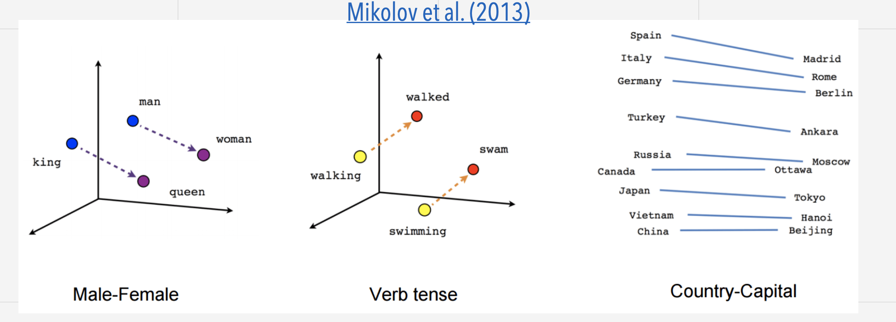

# Transformers

## _Clase 02/06/2023_

## Natural Language Processing

Lenguaje natural: es la lengua o idioma hablado o escriot por humanos para propósitos generales de comunicación. 

El procesado de lenguage natural (NLP) engloba todas las téncicas computacionales de análisis y manipulación de lenguaje natural, con el objetivo de la compresion o la generación de textos.

## Importancia del texto

La cantida de texto crece exponencialmente. Se producen datos a un ritmo de 2.5 Exabytes al día (1.7 MB por peprsona/segundo). Se estima que llegará a 463 Exabytes para el año 2025.

Aproximadamente el 80% de todos los datos se estima que son datos de texto no estructurados.

## Qué es el lenguaje

Sistema estructurado de comunicación formado a partir de la combinación de componentes constituyentes: caracteres -> palabras -> frases -> ideas

El NLP extrae las ideas del texto y las convierte en datos estrucutrados (Vecotres numéricos) para poder procesarlo.

## Flujo de trabajo en NLP

    

## Preprocesado: división del texto

El tokenizado es el proceso de dividir el texto en sus unidades mínimas de singificado semántico (tokens).

Esto s tokens se convierten en números (token IDs) que se usan como entrada a los modelos de ML/Dl.

- Word tokenization: separa el texto en palabras usando los espacios en blanco

- Subword level tokenization: no se separan las palabras más comunes, y se descomponen las palabras raras en partes (subwords) con un significado.

## Word embeddings

Representación vectorial de los términos del vocabulario en un espacio fectorial continuo basado en la similtitud semántica y de contexto. Se base en los conceeptos de:

- Semántica distribuida. las palabras que aparecen en el mismo contexto tienen signficados semánticos similares.

- Connotación: el significado de una palabra se puede extraer de su contexto.

Las palabras similares produces vectores similares. Esto permite generalizar una frase a frases parecidas. Las analógías entre palabras se codifican como diferencias en los vectores dentre las palabras

## Modelos Deep Learning

Los modelos DL utilizan los word embeddings del texto como entrada.

- Cada entrada de texto no tiene una longitud fija, sino n x dim (siendo n el nº de palabras, dim la dimensión del embedding)

- Los word embeddings mantienen el signficado semántico de las palabras

- Estos vectores conforman la entrada a modelos neuroanles profundos cuya salida puede ser única por documento o por palabra, según la aplicación

**Implementaciones**:

- Redes Convolucionales (CNN)
- Redes Recurrentes (RNN)
- Transformers

### Esqumas modelos Deep Learning

Se me genera un vector numérico por cada uno de los tokens de entrada.

## Redes Convolucionales

1. Aplican filtros convolucionales 1D al texto. 
2. Obtiene el máximo de cada filtro.
   
• Convierten cada documento de longitud variable en un v dimensiones.

## Redes Neuronales Recurrentes (RNN)

Las RNNs utilizan la entrada actual y las anteriores generando una secuencia temporal.

- La entrada al modelo es una secuencia de n palabras
- n tiene que ser fijo (padding / truncating)
- Cada palabra tiene d dimensiones (word vector)
- La misma RNN se “desenrolla” para todas las entradas (los pesos son comunes)
17

### Estructura de la neurona

### Arquitectura many to one:

### Arquitectura many to many:

### Arquitectura one to many:

### Arquitectura encoder-decoder:

### Arquitectura encoder-decoder con atención:

 

 

## Modelos Transformer

Sustituyen las RNN por un modelo de capas de atención con FNN. La entrada al modelo es una secuencia de n palabras con d dimensiones (word vector). Cada capa tiene una subcapa de atención (de todas a todas las palabras) seguida de una red neuronal FNN densa.

Cada capa tiene una subcapa de atención (de todas a todas las palabras) seguida de una red neuronal FNN densa.

### Positional Encoding

Se genera un vector que se suma al input embedding de cada token para considerar la información de su posición.

### Mecanismo de atención

## Arquitectura de los transformers

Encoder: recibe una entrada y genera una representación de ella (vector de características). Permite entender el sentido del texto de entrada.

Decoder: utiliza la representación vectorial de la entrada para generar una secuencia de texto de salida.

Cada parte se puede utilizar de manera independiente según la tarea a
realizar:

- Modelos sólo Encoder (auto-encoder): tareas que requieren entender/ interpretar la entrada de texto, como clasificación de frases o de tokens (NER, POS).

- Modelos sólo Decoder (auto-regresivos): tareas de generación de texto.

- Modelos encoder-decoder (sequence-to-sequence): tareas generativas a partir de una entrada de texto (traducción, generación de resúmenes).

 

 

## Aprendizaje de Transformers

Los transformers se pre-entrenan de manera auto-supervisada (self-
supervised) sobre grandes volúmenes de texto.
Aprenden con dos tipos de tareas:

• Causal language modeling: predicción de la siguiente palabra/frase.

• Masked language modeling: predicción de palabras enmascaradas dentro de una frase.

Los transformers se pre-entrenan de manera auto- supervisada (self-supervised) sobre grandes volúmenes de datos.

Los modelos pre-entrenados se adaptan (fine-tuning) para una tarea concreta de manera supervisada.

Los modelos pre-entrenados se adaptan (fine-tuning) para una tarea concreta de manera supervisada.

Los modelos pre-entrenados se pueden usar como feature extractors para generar la entrada a un modelo ML.

 

 

## Tokenizado

El tokenizado (tokenization) es el proceso de dividir el texto en sus unidades mínimas de significado semántico (tokens).

Estos tokens se codifican como números (token IDs) que se usan como entrada a los modelos de DL.

Word tokenization: separa el texto en palabras usando los espacios en blanco.

Subword level tokenization: no se transforman las palabras más comunes, y descompone las palabras raras en partes (subwords) con un significado.

### Subword Tokenization

Hay 3 modalidades principales:

- Byte-Pair Encoding (BPE)

- WordPiece

- Unigram

### Byte-Pair Encoding tokenization

1. Se parte de un vocabulario de todos los caracteres individuales.
2. Se van incorporando nuevos pares de tokens por mayor frecuencia
de aparición.
3. Así hasta llegar a un tamaño de vocabulario definido (hiperparámetro).

### WordPiece tokenization

1. Se parte de un vocabulario de todos los caracteres individuales.
2. Se van incorporando nuevos pares de tokens según el criterio de
máxima verosimilitud (maximum likelihood).
3. Así hasta llegar a un tamaño de vocabulario definido o se rebaja un
umbral de verosimilitud.

### Unigram tokenization

1. Se parte del vocabulario de todas las palabras y símbolos.
2. Se va eliminando un % de los pares de tokens según un criterio de
mínima pérdida (log likelihood).
3. Siempre se mantienen todos los caracteres individuales en el
vocabulario.

Se suele usar en conjunción con el algoritmo SentencePiece para separar los tokens iniciales del vocabulario.