# Notas Clases Redes Neuronales

## _Clase 05/05/2023_

# Fundamentos

## Introducción

### RRNN

Objetivo: Entender el funcionamiento de las redes nueronales totalmente conectadas.

#### RRNN Biológicas

Las neuronas son células que se comunican entre sí a través de señales eléctricas y químicas. 

Las nuronas reciben señales a través de las dendritas y las envían a través de los axones, en caso de que se activen.

Las nuronas dan más importancia a unas señales de entrada que a otras para activarse.

#### RRNN Artificiales


Las neuronas artificiales imital las entradas y salidas con uan función que recibe una serie de entradas numéricas ponderadas y se activa si la suma de las mismas supera un cierto umbral.

Esta simplifiación del funcionamiento de las nueronas biológicas no tienen en cuenta la creación odestrucción de nuevas conexiones entre neuronas, pero ha demostrado ser muy útil en diversos ámbitos. 


Una neurona es una unidad de computación simple, cuya función es procesar información de entrada para reaccionar en consecuencia produciendo una salida. Entrada valor numérico 'x' y salida valor numérico 'y'.

<p align="center">

</p>


La funcion de activacion determina como reacciona una neurona a una entrada determinada. La función de activación en las redes neuronales es definida por el desarrollador


<p align="center">
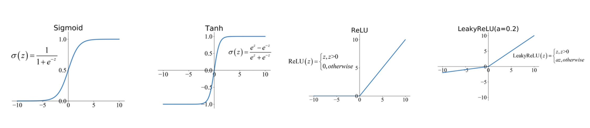
</p>


Una red neuronal es un grafo de cálculo que combina diversas neuronas con múltiples variables de entrada.

Las variables de entrada y las neuronas se relacionan entre sí a través de conexiones, las cuales tienen asociados unos pesos.

Los pesos ponderan en que medida medida los extremos de las conexiones se relacionan entre si.

La capa de entrada está formada por las variables de entrada a la red neuronal. Puede ser cualquier tipo de valor numérico. Ejemplos:

- Píxeles de una imagen
- Caracerísticas de un producto
- Parámetros del funcionamiento de una línea de producción


Las capas oculatas de la red son aquellas que se encuentran entre la capa de entrada y la capa de salida. habitualmente están formadas por cientos o miles de neuronas.

Entrada: variables de entrada/Activaciones de otras capas oculatas, ponderadas por los pesos.

Salida: activaciones de las neuronas de la capa f(entrada)

Principales parámetros: Función de activación y número de neuronas.

<p align="center">
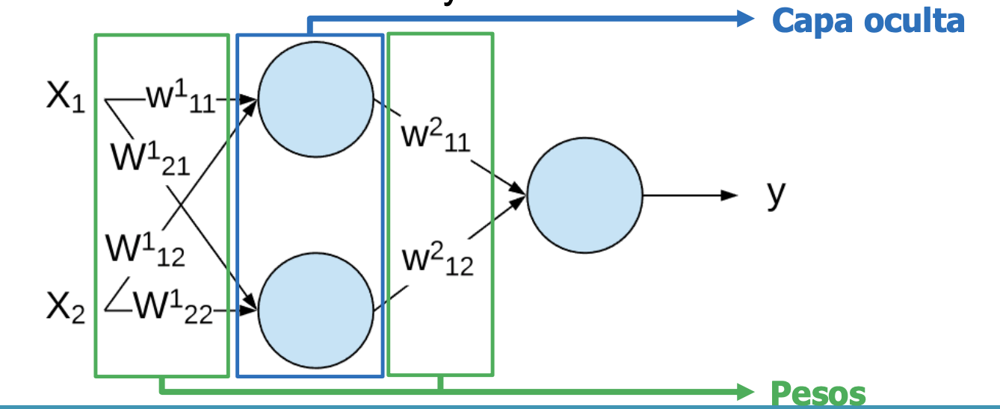
</p>

La capa de salida es la última capa de la red neurona. Funciona de la misma forma que las capas ocultas. Pero tiene 2 diferencias de diseño principales:

la función de activación que se elige

Número de neuronas, directamente ligado al problema al que se van a aplicar.


Funciones de activación más comunes en la capa de salida:

Problemas de regresión: 
- Función de salida Lineal. 
- Número neuronas en la capa de salida = Número de parámetros a estimar

Problemas de clasificación: 
- Función de salida:  Softmax
- Número de neuronas = número de clases

<br>

## Aprendizaje

Para que una red neuronal aprenda una determiada tarea se requiere de muestras etiquetadas.

El orden de muestras necesarias puede variar entre cientos y millones dependiendo de la complejidad del problema.


<p align="center">

</p>


El aprendizaje de una red neuronal consiste en actualizar sus pesos de tal manera que se minimice el error que se produce al analizar los datos de entrenamiento para una tarea detemrinada.


Las funciones de périddas nos permiten evaluar el grado de efectividad de una red neuronal en una tarea concreta.

Cada tipo de tarea require de una función de périda distina.

El aprencizaje de las redes nueronales es un problema de otpimización. el objetivo es encontrar el conjunot de pesos W que minimice la función de pérdidas de la red neuronal para el conjunot de datos de entrenamiento.

Probelmas de Regresión:
Error cuadrático medio

$$MSE = \frac{1}{N} \sum_{i=1}^{N} (y_i - \hat{y_i})^2$$


Problemas de Clasificación:
Entrópia cruzada

$$H_y'(y) := - \sum_{i} (y_i' \log(y_i) + (1-y')\log(1-y_i)$$


El descenso por gradiente es un método iterativo que permite encontrar el mímino de una función con respecto a sus variables utilizando derivadas parciales.

La intensidad de la actualización de los pesos está regulada por la Tasa de Aprendizaje ($\alpha$). Este parametro es fijado por el desarrollador.


<p align="center">

</p>


El algoritmo que permite entrenar las redes neuronales se denomina Retro-Propagación. El algoritmo comigna el Descenso por Gradiente con la regla de la cadena para calcular las derivadas parciales de la función de pérdidas con respecto a los pesos de la red neuronal.

<p align="center">

</p>


El aprendizaje de una red neuronales es un proceso iterativo en el que se realizan las prediccioones sobre las muestras de entrenamiento y se ajustan los pesos en base a una fucnión de coste que pdepende de la veracidad de las predicciones.

Al proceso de predicción del conjunto de datos de entrenamiento y posterior actualización de los pesos se le denomina epoch.

El número de epochs de entrenamiento es un parámetro que debe ser fijado por el desarrollador.

Es recomendable el entrenamiento de RRNN en GPU en lugar de CPU. El número de muestras de entrenamiento que cuyo análisis se paraleliza simultáneamente se denomina tamaño de batch. El tamaño de batch es definido por el desarrollador en función del hardware del que dispone.


## Resumen clave

Parámetros que se tienen que elegir y ajustar durante el diseño de redes neuronales totalmente conectadas.

- Número de capas ocultas
- Número de neuronas por capa
- Función de activación
- Función de pérdidas
- Tasa de aprendizaje
- Número de epochs
- Tamaño de batch


------------------

<br>

<br>

# Redes Neuronales Conectadas (Procesamiento del Lenguaje Natural)

## _Clase 12/05/2023_

## ¿Qué es el Procesado de Lenguaje Natural (NLP)?

El lenguaje natural es considerado un rasgo distintivo de la inteligencia humana

• Se define como el lenguaje hablado y escrito que utilizamos a diario

• Es el mayor depósito de conocimiento humano que existe

• Permite la interacción hombre-máquina mediante sistemas que entienden el lenguaje natural

Abordaremos el Natural Language Processing (NLP) desde la perspectiva del Aprendizaje Profundo (DL, Deep Learning)

• Veremos diferentes formas de representar el lenguaje y la solución más adoptada: los embeddings

También resolución de problemas usando técnicas basadas en Recurrent Neural Networks (RNNs) y arquitecturas avanzadas.


Rama de la informática y de la Inteligencia Artificial (AI, Artificial Intelligence) que cubre la comprensión y generación de lenguaje natural

• No está limitado únicamente al texto (e.g. hablado, lengua de signos, ...)


• Sin embargo el texto escrito es el que más avanzado está

• También es del que hay más datos disponibles

• Por cierto, la voz artificial suena cada vez más humana, con inflexiones tonales y prosódicas que imitan la producción humana

• También los modelos son cada vez más avanzados (¿quién conoce ChatGPT?)
No pertenece únicamente al campo de la AI
• También está relacionada con otros campos como la linguística, psicolinguística, las ciencias cognitivas y la estadística

Uno de sus objetivos es conseguir que los ordenadores trabajen con nuestro lenguaje en lugar de trabajar nosotros con el suyo


El NLP se puede dividir en dos áreas de trabajo bien diferenciadas:

• Natural Language Generation (NLG): Tiene como objetivo la generación de lenguaje a partir de representaciones internas

• Puede considerarse como un componente de traducción entre los datos y el lenguaje natural

• Se subdivide en múltiples tareas: planificación del discurso, selección léxica, ...

• Natural Language Understanding (NLU): Área que centra su atención en la comprensión lectora de las máquinas

• Transformar el lenguaje natural en una representación adecuada para la máquina

• Normalmente, requiere diferentes niveles de análisis: morfológico, sintáctico, semántico, discurso, ...

El NLU es mucho más complejo que NLG. Dicho esto, ambos problemas son muy difíciles.


<br>

## Los dos enfoques principales del NLP

**Basados en gramáticas o modelos lógicos: Enfoque top-down**

• Diseñados para intentar reflejar la estructura lógica del lenguaje

• Surgen de las teorías lingüísticas de N. Chomsky a mediados de los 1950

• Se basan en desarrollar reglas de reconocimiento de patrones estructurales, utilizando un formalismo gramatical específico

• Las reglas, junto con la información adicional almacenada, definen los patrones de reconocimiento a usar

**Basados en datos: Enfoque bottom-up**

• Abarcan tanto modelos probabilísticos como basados en Aprendizaje Automático (ML, Machine
Learning)

• Se recogen ejemplos y datos (corpus) y se calcula su probabilidad de aparecer en un contexto determinado

• Nos permiten predecir la siguiente unidad en un contexto determinado sin reglas gramaticales


<br>

## Los principales desafíos del NLP

El lenguaje natural es orgánico, es decir, poco consistente (cambia, evoluciona, ...)

• Todo lo contrario a los lenguajes informáticos, cuyo objetivo es ser consistentes

• No involucran solo al lenguaje hablado: feedback y lenguaje no verbal, empatía, ...

Además, lo normal es que no estén bien construidos

• A veces la gramática no es consistente, otras veces hablamos o escribimos mal

• Curiosamente, en muchos de estos casos ¡nos entendemos!

La gestión de cada uno de sus retos es compleja

• Abordarlo todo a la vez es impracticable Los problemas se suelen acotar mucho para simplificar su resolución

Vamos a ver cuáles son los principales desafíos que plantea el NLP

• Podemos considerar algunos de ellos como moderadamente superados

• Otros, sin embargo, siguen siendo un problema abierto en el área


• Ambigüedad en los lenguajes naturales

• En el lenguaje natural una palabra puede tener diferentes significados (contexto, modismos,
hipérboles)

• Sesgos y prejuicios inherentes al lenguaje

• Existen sesgos debidos a los datos utilizados para la creación de los modelos:

• Hombre es a mujer como desarrollador es a ama casa

• Negro es a delincuente como blanco a policía

• El sentimiento de ira es mayor en frases con más sustantivos femeninos

• El de ofensivo es mayor en aquellos tweets escritos por afroamericanos

• Evaluación de los resultados

• Todavía no disponemos de herramientas útiles para entender por qué ciertas técnicas y
arquitecturas funcionan mejor que otras en según qué escenarios

• Necesitamos una nueva generación de conjuntos de datos y técnicas de evaluación


Es esencial tratar los problemas de sesgo antes de que lleguen al Mundo Real

• Ejemplo: Sistema COMPAS, evaluación de probabilidad de reincidencia en crímenes

• Este sistema se ha utilizado en algunas de las cortes de justicia de los EEUU

• Resultó tener un evidente sesgo implícito contra los ciudadanos afroamericanos

• Hasta el doble de falsos positivos frente a ciudadanos caucásicos

• Este sesgo implícito no se detectó antes de que se implantara el sistema

• Se predijo injusta e incorrectamente que muchos afroamericanos volverían a delinquir Pero, ¿cómo pueden ser parciales los algoritmos si no tienen emociones?

• El ML aprende de los datos

• Son pizarras en blanco que se van rellenando según van encontrando patrones

• El problema son los datos, que poseen implícitamente sesgos

• Además la moral de una sociedad evoluciona con el tiempo


Alternativas que se investigan para mitigar el sesgo:

• Eliminar el sesgo de los datasets

    • Una opción, eliminar los conjuntos de datos existentes que contienen sesgos

    • Otra, revisar datasets existentes y nuevos para eliminarlos

    • La forma más aceptada de eliminar el sesgo es diversificarlo

    • Muy costoso ya que se requiere analizar datasets que no son precisamente pequeños

• Eliminar el sesgo de los modelos

    • Modificar las representaciones vectoriales de las palabras en los propios modelos

    • Vía mucho más eficiente con resultados prometedores (aunque no infalibles)


## Pre-procesamiento de texto

### Expresiones regulares

¿Qué son las expresiones regulares?

• Las expresiones regulares son patrones utilizados para encontrar una determinada secuencia de
caracteres dentro de una cadena de texto.

• Son especialmente útiles cuando se busca una determinada secuencia de caracteres dentro de una gran cantidad de texto.

Por ejemplo:

• Podemos extraer los números existentes en un texto.

• Podemos encontrar los emails presentes en un texto.

• Podemos buscar los códigos postales, los teléfonos, etc.

Las expresiones regulares nos permiten especificar el patrón de lo que buscamos, y son muy potentes.


Todos los principales lenguajes de programación utilizan expresiones regulares (C ++, PHP, .NET, Java, JavaScript, Python, Ruby y muchos otros). Estos son los usos principales de las expresiones regulares:

• Buscar elementos particulares dentro de un gran texto.

• Por ejemplo: identificar todas las direcciones de correo electrónico en un texto.

• Reemplazar artículos particulares.

• Por ejemplo: limpiar un poco de HTML con formato deficiente reemplazando todas las etiquetas en
mayúsculas con equivalentes en minúsculas. 

• Validar entradas.

• Por ejemplo: verificar que una contraseña cumpla con ciertos criterios. 

• Coordinar acciones.

• Por ejemplo: procesar ciertos archivos en un directorio, pero solo si cumplen condiciones particulares.

• Reformatear el texto.

• Por ejemplo, puedes exportar datos de un programa como un archivo de texto, luego modificar tu diseño para que puedas importarlo en otro programa usando un editor de texto.


Sintaxis básica

• La sintaxis básica de una expresión regular consiste en caracteres literales y meta-caracteres.

• Los caracteres literales son aquellos que se buscan exactamente en la cadena de texto, mientras que los
meta-caracteres tienen un significado especial y se utilizan para buscar patrones específicos.

Por ejemplo:

La expresión regular gato buscará la secuencia de caracteres "gato" en una cadena de texto.

Sin embargo, la expresión regular gat. buscará cualquier cadena de texto que comience con "gat" y tenga cualquier otro carácter después.
Un ejemplo más complejo:

Podemos encontrar correos electrónicos mediante la siguiente expresión: 

```py
/[\w._%+-]+@[\w.-]+\.[a-zA-Z]{2,4}/
```


<br>

## Bag of Words (BoW)

**¿Qué es la bolsa de palabras o Bag of Words?**

• En el procesamiento del lenguaje natural (NLP), Bag of Words (BoW) es una técnica común utilizada para
la representación de texto.

• La idea principal detrás de esta técnica es que se puede representar un documento como un conjunto de palabras sin importar la estructura gramatical y el orden en el que aparecen las palabras en el texto.


**¿Cómo se utiliza?**

El proceso para crear un modelo BoW se puede resumir en los siguientes pasos:
1. Limpiezadeltexto:Seeliminanloscaracteresnodeseadosylasstop-words.
2. Tokenización:Sedivideeltextoenpalabrasotérminosindividuales.
3. Construccióndelvocabulario:Secreaunvocabulariodetodaslaspalabrasúnicasencontradasenel corpus.
4. Codificacióndeltexto:Secuentalafrecuenciadecadapalabraencadadocumentoysecreauna matriz donde cada fila representa un documento y cada columna representa una palabra en el vocabulario.


<br>

## Term Frequency – Inverse Document Frequency


Hasta ahora hemos visto como pasar de lenguaje natural a una representación vectorizada del mismo. Aunque en este punto ya tenemos una buena representación vectorial de nuestros textos, sigue habiendo
un problema: la representación creada no está normalizada.

Esta no normalización plantea dos problemas:

• A nivel de documento (las filas de nuestra matriz de datos) cada texto lleva una escala completamente libre y hace imposible compararlos entre sí.

• A nivel de palabras es complicado comparar cuáles son más relevantes y cuáles menos en un corpus concreto.


Profundicemos un poco más:

• A nivel de documento (las filas de nuestra matriz de datos) cada texto lleva una escala completamente
libre y hace imposible compararlos entre sí.

• Un texto más largo tendrá contadores con valores mayores que un texto más corto.

• En un ejemplo llevado al extremo podemos comparar un tuit con la noticia que enlaza ese tuit. Ambos documentos versarán sobre el mismo tema, pero no podrán compararse debido a la volumetría de ambos.


• A nivel de palabras es complicado comparar cuáles son más relevantes y cuáles menos en un corpus
concreto.

• Ya hemos eliminado las stop-words, pero, dependiendo del bias (sesgo) de nuestro corpus hay palabras que no aportan demasiada información y, por tanto, su incidencia en nuestro algoritmo de machine learning debería ser menor.

Por ejemplo, imaginemos que tenemos un corpus de documentos que sólo hablan de los equipos de la Liga de Fútbol Profesional.

• En este corpus la palabra "fútbol" es completamente irrelevante, ya que todos los documentos hablan de ella. Por el contrario, palabras como "lesión" o "fichaje" son muy relevantes porque permiten subclasificar los documentos.

• Sin embargo, si nuestro corpus está formado por noticias de todo tipo, la palabra 'fútbol' es muy relevante porque identifica un tipo de noticia.


<br>

<br>

## Word embeddings

• Los word embeddings son una técnica en NLP que se utilizan para representar palabras como vectores numéricos de valores continuos en un espacio de alta dimensión.

• Se utilizan para codificar el significado de las palabras de manera que puedan ser procesadas por algoritmos de aprendizaje automático y así mejorar el rendimiento de las aplicaciones de procesamiento del lenguaje natural.

• Los word embeddings permiten que las palabras sean representadas de forma semántica en un espacio vectorial, donde las palabras que tienen significados similares se agrupan juntas. Esto es útil para muchas tareas de NLP, como la clasificación de texto, la traducción automática, la respuesta a preguntas, la detección de sentimientos y la generación de texto.

• Además, los word embeddings pueden ser utilizados para reducir la dimensionalidad de los datos, lo que puede ayudar a mejorar la eficiencia del procesamiento de texto en aplicaciones de NLP.

• También permiten detectar patrones complejos en los datos de texto y establecer relaciones entre diferentes palabras.


• Bag of words y TF-IDF no son técnicas de embeddings de palabras en sí mismas, sino que son técnicas para representar palabras en un documento o corpus de texto.
• El Bag of words es una técnica que se utiliza para contar la frecuencia de las palabras en un documento.

• TF-IDF es otra técnica para representar palabras en un documento que tiene en cuenta tanto la
frecuencia de las palabras en el documento como su importancia en el corpus de texto en general.

• Aunque Bag of words y TF-IDF no son técnicas de embeddings de palabras, se pueden (y suelen) utilizar para preparar los datos antes de aplicar técnicas de embeddings de palabras como Word2Vec, GloVe, FastText y ELMo, entre otras.


**Ejemplos de embeddings**

• Word2Vec: Es una técnica popular de embeddings de palabras en NLP.

• Utiliza redes neuronales para aprender la representación vectorial de las palabras en un corpus
de texto.

• Las palabras son representadas en un espacio vectorial y su significado semántico se captura a través de las relaciones entre las palabras.

• GloVe: Es otra técnica popular de embeddings de palabras en NLP.

• GloVe (Global Vectors) utiliza la matriz de co-ocurrencia de palabras en un corpus de texto para
aprender la representación vectorial de las palabras.

• Mantiene las propiedades de la relación entre palabras en el espacio vectorial.

• ELMo: Es una técnica de embedding de palabras basada en redes neuronales profundas bidireccionales.

• Utiliza una arquitectura de modelo de lenguaje para aprender la representación vectorial de las palabras en función de su contexto.

• Es capaz de capturar diferentes sentidos de una palabra dependiendo de su contexto.

Estas técnicas son solo algunas de las muchas disponibles en NLP y cada una tiene sus propias ventajas y desventajas.


<br>

<br>

<br>

------------


## _Clase 13/05/2023_


## RRNN (Redes Neuronales Recurrentes)

### Problemas temporales

¿Cómo abordamos problemas con componente temporal?

• ¿Cómo podemos predecir las compras de un determinado producto en un periodo concreto de tiempo?

• ¿Y las personas que viajan con una determinada aerolinea?

• ¿Podríamos predecir el valor de una determinada acción en bolsa?

• ¿Y predecir la demanda de un determinado producto para avisar a nuestros proveedores?

Necesitamos algún algoritmo con MEMORIA. Las redes neuronales NO la tienen.


### ¿Qué son las Redes Neuronales Recurrentes?

En su esencia, conjuntos de capas y “puertas” que deciden que información guardar y cual no a lo largo del tiempo.

<p align="center">
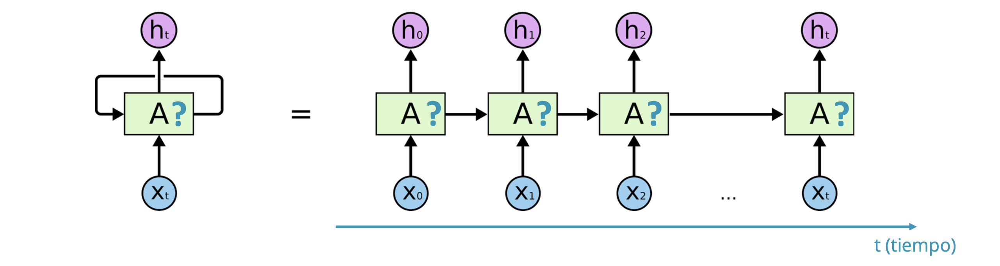
</p>


El diagrama básico expresa la red de forma comprimida. Si lo “desenrollamos” obtenemos la arquitectura real de una RNN. Pero... ¿qué significa?

¿Qué es A?


<p align="center">
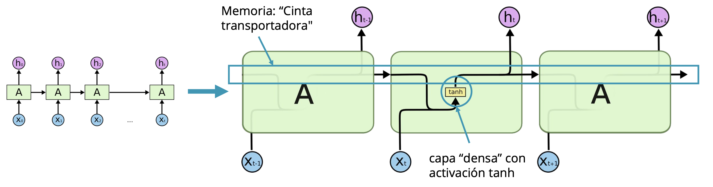
</p>


Ya no tenemos únicamebte una entrada, sino que "arrastramos" un "estado" de una entrada a otra. Así ya tenemos memoria.


### ¿Cómo aprende una RNN a lo largo del tiempo?


<p align="center">
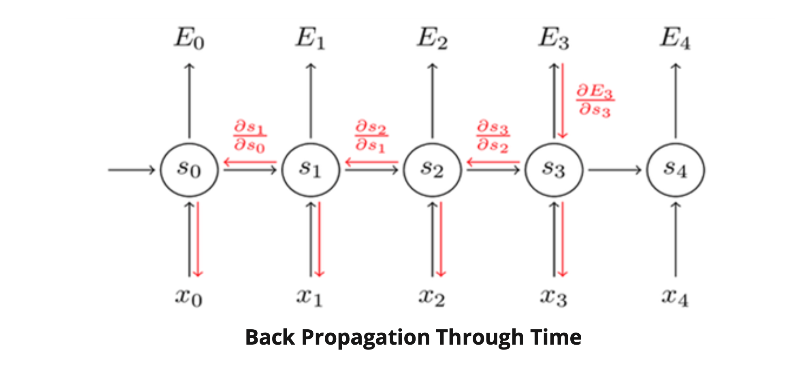
</p>


La red aprende a lo largo del tiempo, y lo hace de forma recurrente. Es decir, el estado de la red en un momento dado depende de su estado anterior y de la entrada actual. Esto es lo que le da la capacidad de memoria. 


### ¿Qué tipos de problemas nos permiten abordar las RNN?


<p align="center">
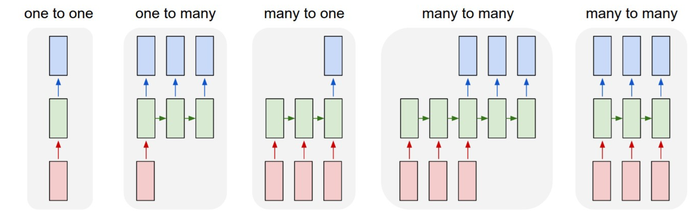
</p>


### Ventajas e Inconvenientes de las RNN

**Ventajas:**

• En general, RNNs dan una buena solución a problemas de predicción de series temporales

• Su desempeño no se ve demasiado afectado por missing values.

• Pueden encontrar patrones complejos en las series

• Dan buenos resultados prediciendo incluso más allá de unos pocos instantes

• Modelan las secuencias de forma que cada muestra se puede considerar 
independiente de las demás (permite shuffle)

**Inconvenientes:**

• Cuando se entrenan en secuencias muy largas sufren el conocido como vanishing gradient or exploding gradient problem

• Las RNNs básicas tienen poca memoria y no pueden tener en cuenta un histórico muy largo

• Su entrenamiento es dificilmente paralelizable y además es muy costoso computacionalmente

A continuación vemos como se pueden resolver algunos de estos problemas


### Long Short Term Memory (LSTM)

Igual que las RNN, pero incorporan mecanismos para elegir qué “recuerdan” y qué “olvidan”:

- “Cinta transportadora”: mantiene en memoria los datos necesarios
- Puerta de olvido: elimina datos de la cinta transportadora
- Puerta de entrada: añade datos a la cinta transportadora
- Puerta de salida: decide qué datos de la cinta transportadora va a sacar la red por salida en cada instante $t_n$

<p align="center">
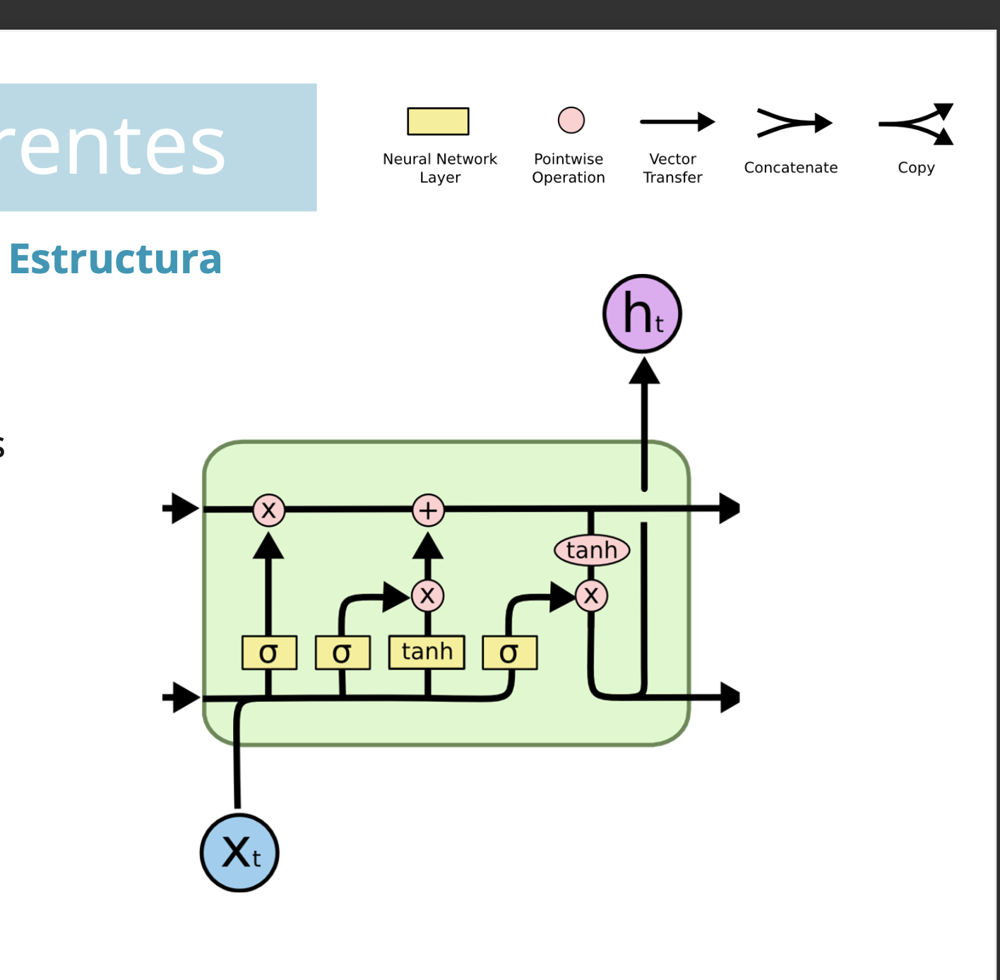
</p>

La “cinta transportadora” es el estado de la celda LSTM, es decir, la memoria.
Para cada predicción, la celda combinará la información en la memoria con la entrada que reciba para producir la salida.

<p align="center">
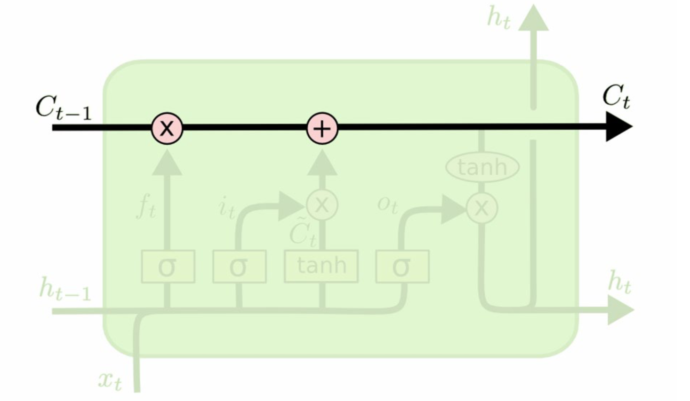
</p>

Las puertas se componen de una red neuronal de una capa con función de activación sigmoide, lo cual da como salida un “mapa de memoria”, que multiplicados por la salida del instante anterior y la nueva entrada, decide qué pasa al siguiente punto.
El mapa de memoria toma valores entre 0 y 1.


<p align="center">
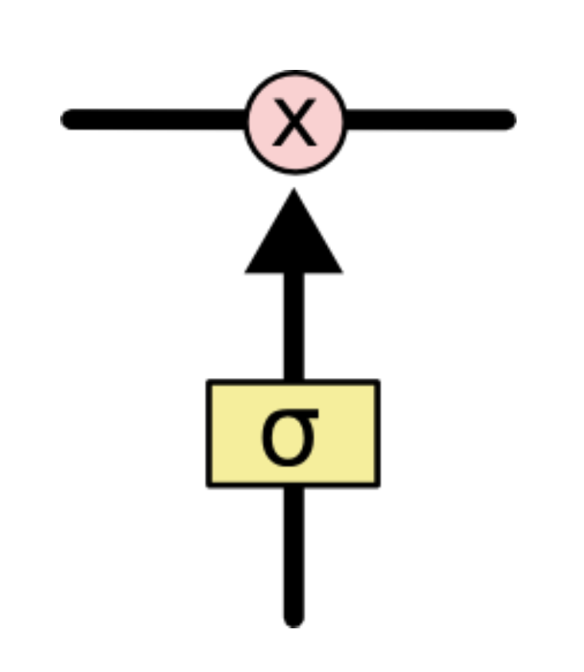
</p>


Puerta de olvido: elimina datos de la cinta transportadora

<p align="center">
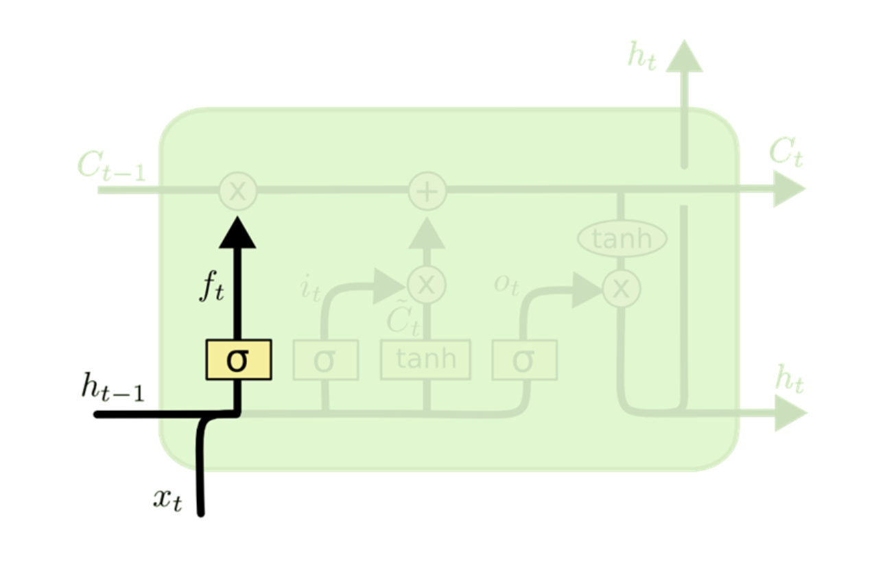
</p>


$$f_t = \sigma(W_f \cdot [h_{t-1}, x_t] + b_f)$$


Puerta de entrada: añade datos a la cinta transportadora

<p align="center">
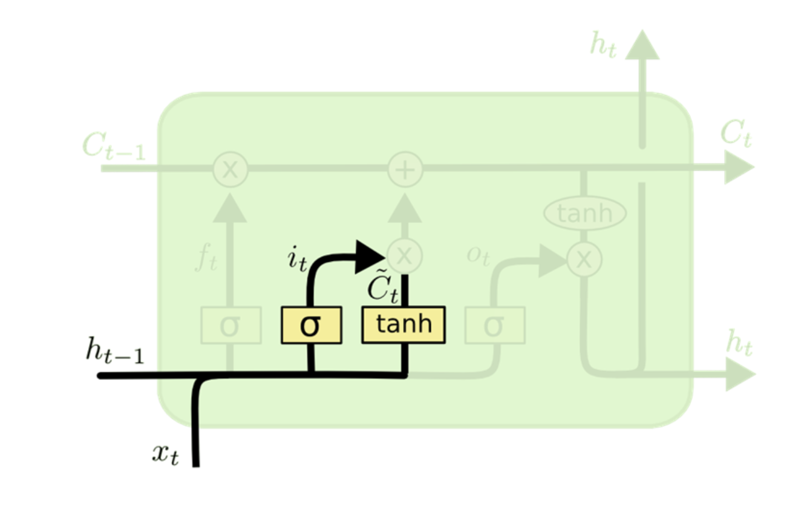
</p>

$$i_t = \sigma(W_i \cdot [h_{t-1}, x_t] + b_i)$$
$$\tilde{C}_t = tanh(W_C \cdot [h_{t-1}, x_t] + b_C)$$


<br>

<br>


## Arquitectura Encoder-decoder

• En las redes RNN, LSTM, GRU y similares, cada entrada corresponde a una salida para un instante dado (tn)

• En muchas ocasiones querremos predecir una secuencia de longitud distinta a la de entrada.

• Por ejemplo, en el caso de traducciones: una frase en un idioma no tiene por qué ser de la misma
longitud que en otro idioma.


¿Cómo podemos lidiar con estos problemas?

• Este tipo de arquitectura se introdujo para lidiar con problemas del tipo many-to-many o sequence-to-sequence.

• Permite diferente longitud de entrada y de salida.

• El codificador procesa la secuencia de entrada y la codifica en un un context vector.

• El decodificador genera la secuencia de salida utilizando la información del context vector.

Sin embargo, si la secuencia es muy larga, el context vector puede no ser suficiente para codificarla.

¿Solución? La atención.


<p align="center">
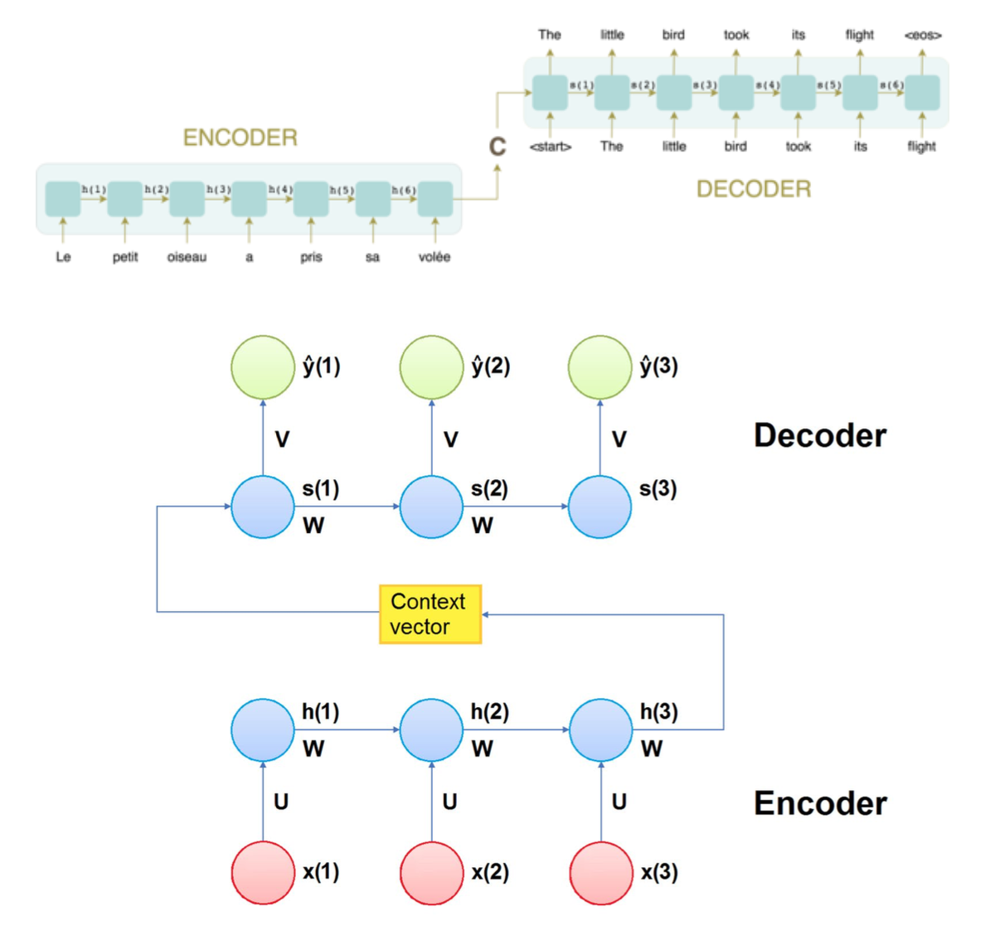
</p>


## Arquitectura Encoder-decoder con atención

• Permite al decodificador fijarse en determinada información codificada por el codificador al decodificar y generar la secuencia de salida

• Se genera un context vector diferente para cada timestep del decodificador, en función del “estado” anterior del decodificador y todos los “estados” anteriores del codificador, asignándoles pesos

• Da mayor peso (atención) a los elementos más importantes

• Da buenos resultados incluso con largas secuencias

• El modelo final es más interpetable

<p align="center">
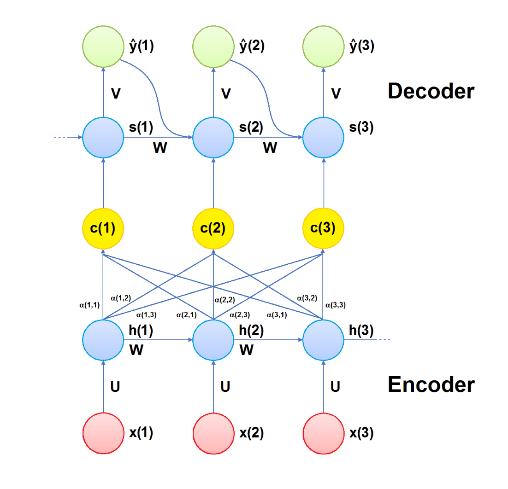
</p>

<p align="center">
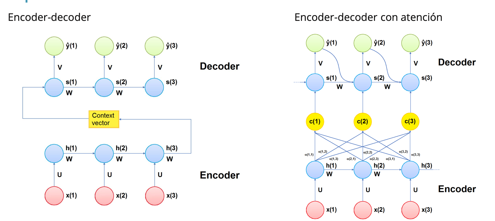
</p>

------------


<br>

<br>

## _Clase 20-05-2023_

# Redes Neuronales Convolucionales


## Visión Artificial

La visión artificial ov isión por ordenador es una disciplina científica que incluye métodos para adquirir, procesar y analizar las imágenes del mundo real con el fin de proudcir información numérica o simbólica para que puedan ser tratados por un ordenador.

El procesamiento de imágnes digitales es el conjunto de téncicas que se aplican a las imágenes digitales con el objetivo de mejorar la calidad o facilitar la búsqueda de información

<p align="center">

</p>


Se llama análisis de imágenes a la extracción de información derivada de imágenes digitales de forma automática o semiautomática mediante algoritmos.

La visión artificial comenzó como un proyecto de verano, cuyo objetivo era conectar una cámara a un ordeandor para que este "describiera lo que veía"


Dentro de la visión artificial, existen tres tipos de problemas que se pueden tratar:

- **Clasificación**: se trata de asignar una etiqueta a una imagen. Por ejemplo, si la imagen es un perro o un gato.

<p align="center">
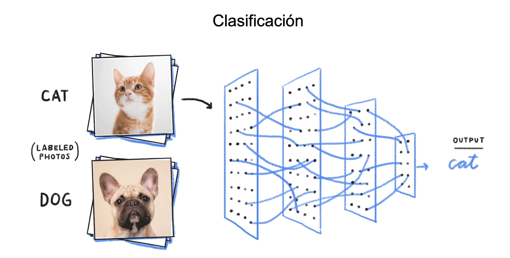
</p>


- **Detección**: se trata de detectar objetos en una imagen y asignarles una etiqueta. Por ejemplo, si la imagen es un perro o un gato y dónde se encuentran en la imagen.

<p align="center">
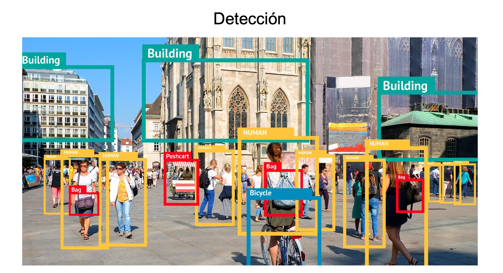
</p>


- **Segmentación**: se trata de decirme cada uno de los píxeles de la imagen a que clase pertenece.

<p align="center">
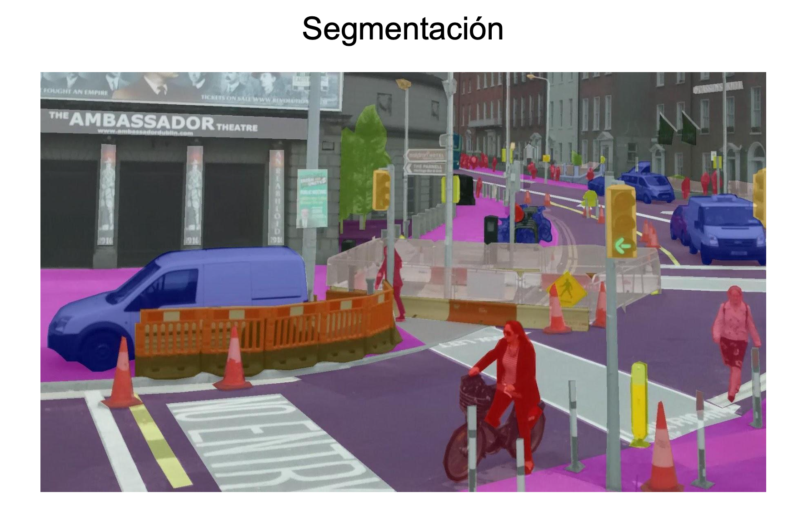
</p>


## Imagen Digital

Las imágenes digitales se codifican mediante matrices bidimensionales de píxeles. Cada píxel tiene asociado un valor concreto dependiendo de la intensidad lumínica que se quiera representar.

<p align="center">
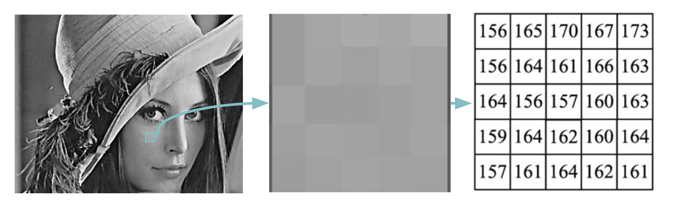
</p>

El valor de un píxel es más elevado cuanto más blanco sea y menor cuanto más tienda al negro.

La intensidad de los píxeles se representa en dos rangos bien definidos:

- [0, 255] si la información se codifica como números enteros sin signo de 8 bits
- [0.0, 1.0] si la información se representa en número en coma flotante de 32 bits.

<p align="center">
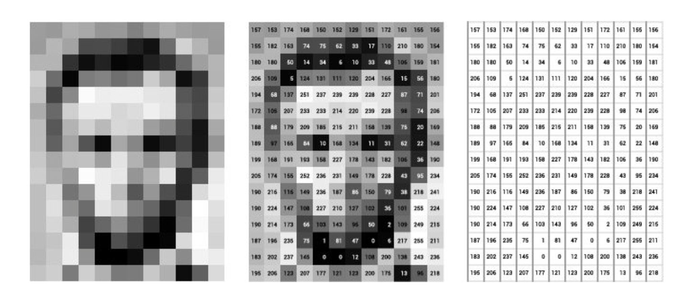
</p>


Los colores se representan en imagen digital como la combinación de intensidad de los canales R (red), G (green), B (blue)

<p align="center">
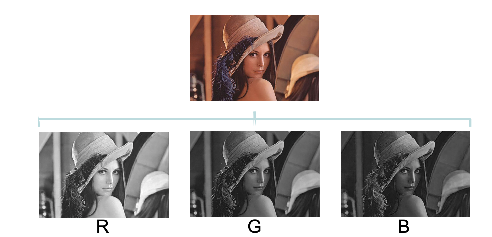
</p>


## Herramientas 

La resolución de una imagen se define por el número de columnas (width) y filas (height) que las componen.

El histograma de una imagen nos permite evaluar la frecuencia de aparición de cada uno de los distintos niveles de intensidad.

<p align="center">
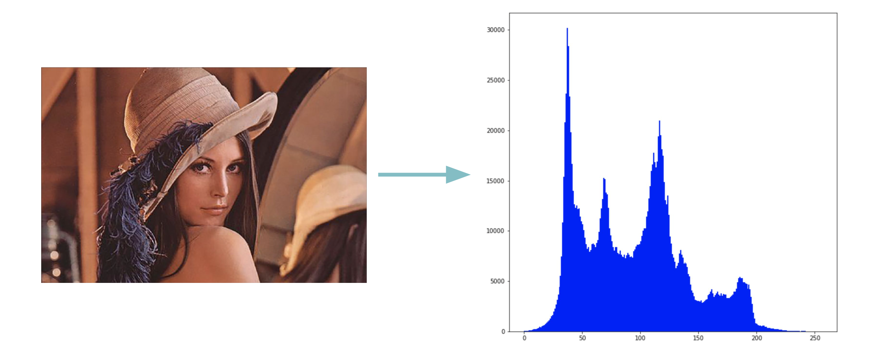
</p>


Si mi histograma está desplazado hacia la izquierda significa que los colores negros predominan. Si está desplazado hacia la derecha significa que los blancos predominan.


La ecualización de histograma permite mejorar el contraste de las imágenes. Para ello utiliza la distribución acumulada de probabilidad como función de transferencia. Se utiliza información global de la imagen. El resultado es un histograma más distribuido entre los distintos niveles de gris.

CLAHE (Contras Limited Adaptive Histogram Equalization) ecualiza la imagen utilizando histogramas de subregiones de la imagen.

Se limita la amplificación del contraste en regiones constantes para no aumentar ruido. Los resultados son generalmente mejores que con la ecualización global del histograma, a cambio de más coste computacional.

<p align="center">
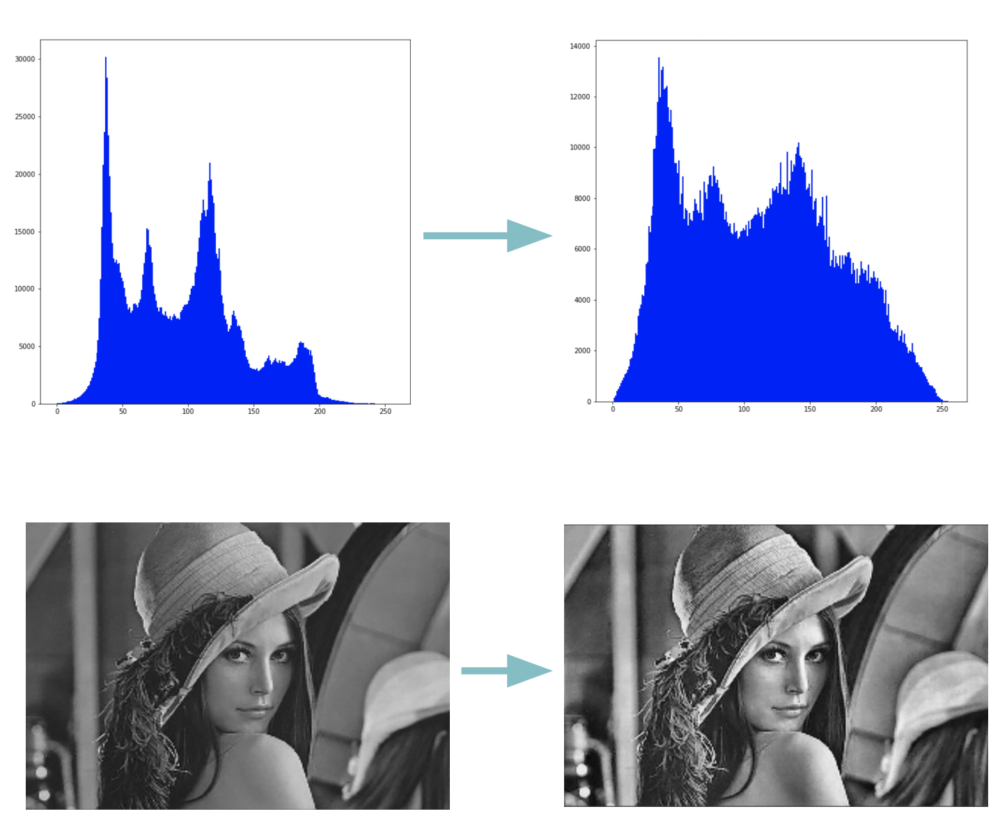
</p>


## Convolución

Una convolución es una operación que permite aplicar un filtro a una imagen para modificarla. un filtro es una matriz pequeña (3x3, 5x5, 7x7, ...) que define como se va a modificar la imagen.

Se aplican multiplicaciones y sumas de la vecindad de cada píxel del aimagen de entrada con el filtro para calcular los valores de la imagen de salida.


<p align="center">

</p>


Se aplican multiplicaciones y sumas de la vecindad de cada píxel de la imagen de entrada con el filtro para calcular los valores de la imagen de salida.

Al aplicar una convolución la imagen de salida es más pequeña que la imagen de entrada. Para solventar esto se utiliza el padding. Existen diversos tipos de paddding, pero el más común es rellenar con ceros.

El filtro promedio permite filtrar altas frecuencias en las imágenes. Los valores del filtro se definen a partir del tamaño de la matriz. Cuanto más grande sea la matriz, más información se eliminará.

<p align="center">
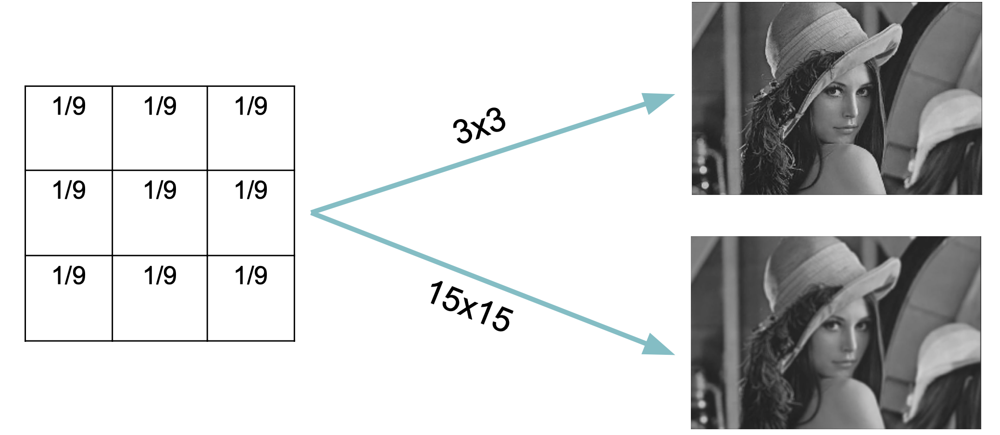
</p>

El filtro gaussiano es una forma más robusta de eliminar altas frecuencias, a cambio de un mayor coste computacional. Los valores del fitro se definen a partir del tamaño de la matriz y de la desviación típica.


<p align="center">
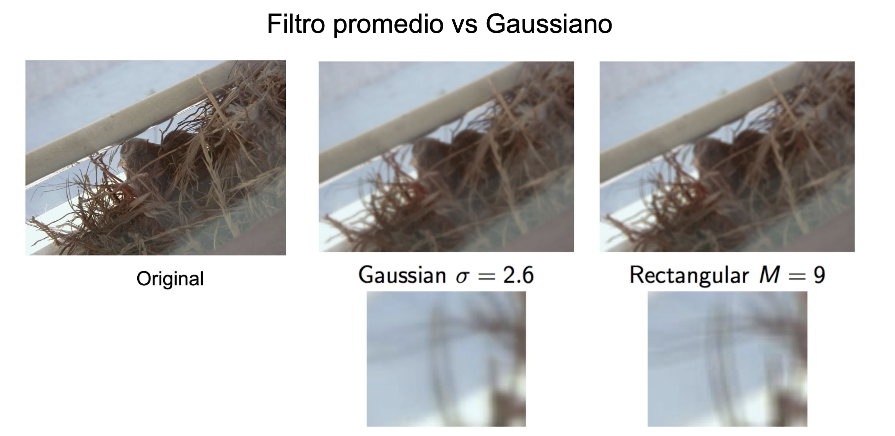
</p>


Los filtros de Sobel permiten obtener los gradientes (derivadas de primer orden) de cambio en horizontal y vertical.

<p align="center">
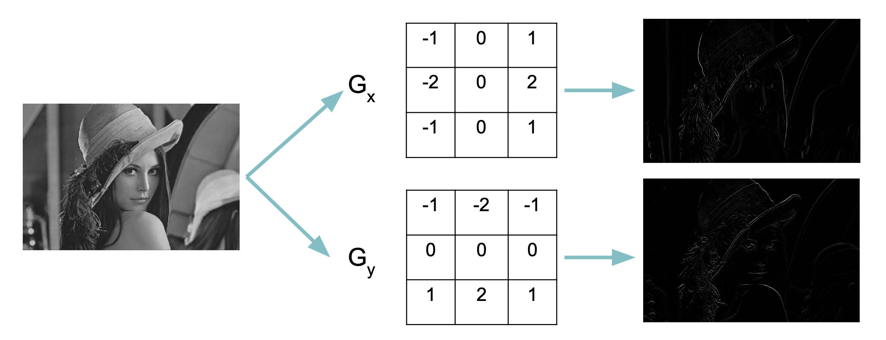
</p>


## Segmentación

La segmentación permite identificar los píxeles de la imagen que pertenecen a un determinado objeto mediante máscaras. Los píxeles de las máscaras de segementación son fijados a 1 (o 255) si peretencen al objeto en cuestión. Estas máscaras permiten la obtención de una gran variedad de parámetros del objeto.

<p align="center">
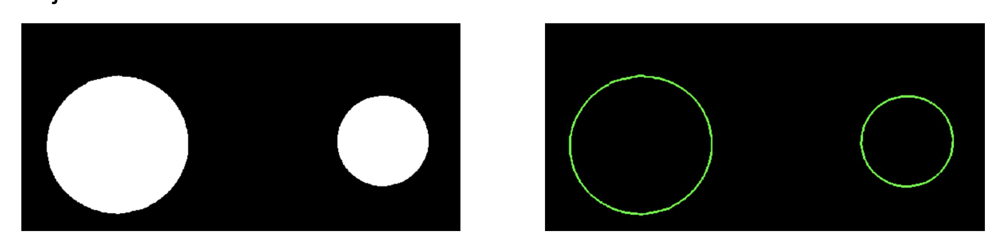
</p>

Algunos de los parámetros que se pueden obtener mediante las máscaras de segmentación son:

- Área
- Relación de aspecto
- Diámetro de contorno
- Boundig box
- Orientación
- ...


<p align="center">
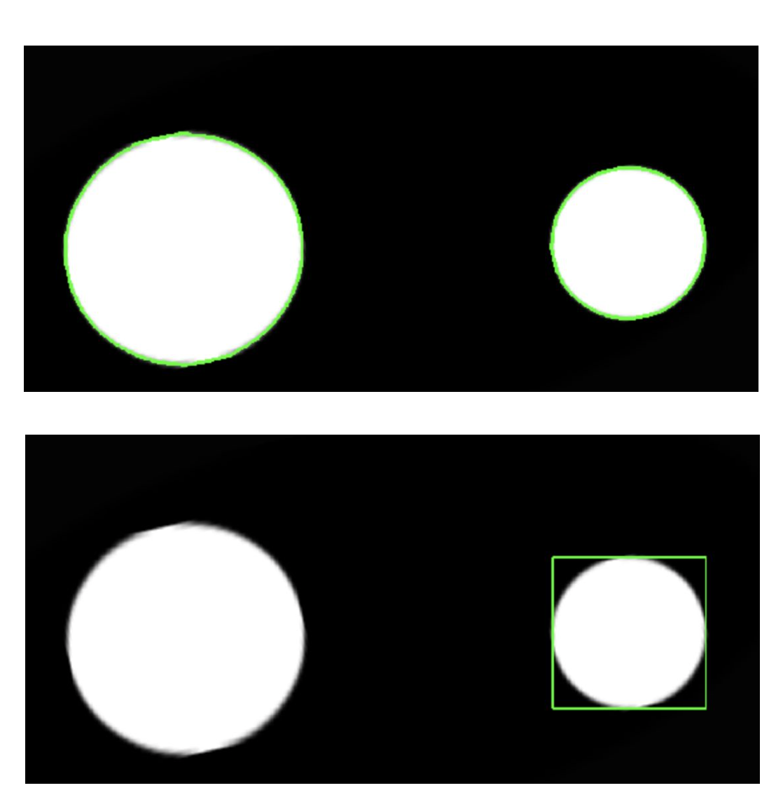
</p>


### Mensajes clave

La visión artificial es un campo de estudio muy extenso, que lleva en desarrollo desde la década de 1960. Los conceptos desarrollados en visión artificial son la base de las redes neuroanles convolucionales, por tanto su estudio es necesario para comprender en que se basan. Las técnicas de pre-procesado son fundamentales en los proyectos de IA basados en imagen.


<br>

<br>

# Teoría Redes Neuronales Convolucionales 

Las CNN están diseñadas para extraer patrones bidimensionales a diferentes escalas y niveles de complejidad.

<p align="center">
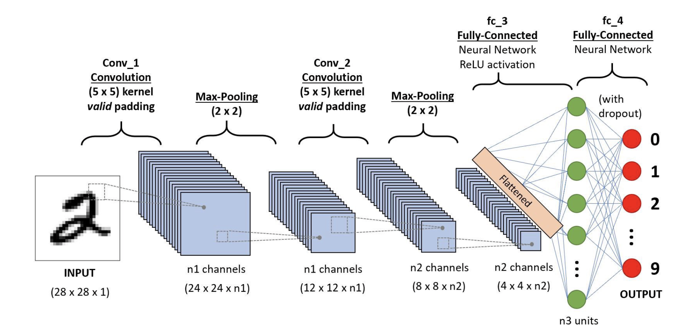
</p>

Según la imagen de entrada se procesa en capas más profundas de la red las características extraídas son más complejas.

<p align="center">
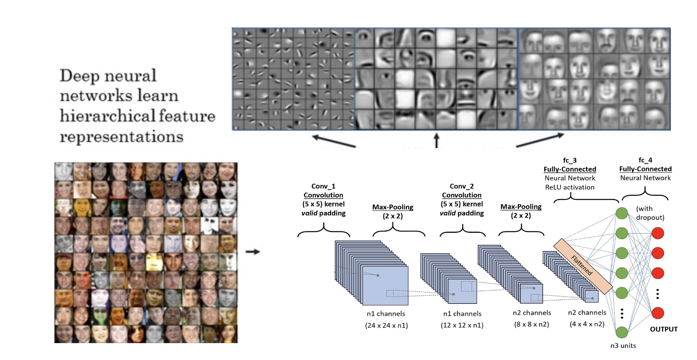
</p>


La popularización de las CNN para resolver problemas complejos de Visión Artificial comenzó en 2012 con el challenge ILSVRC (ImageNet Large Scale Visual Recognition Competition). 


ImageNet es un conjunto aproximadamente 15 millones de imágenes anotadas con 22000 clases diferentes.

ILSVRC proponía un subconjunto de 1.2 millones de imágenes y 1000 clases.

Este desafía era extremadamente complejo de afrontar con metodologías de
Visión Artificial o Machine Learning tradicionales.

A partir de la utilización de CNN para afrontar el desafío el error se redujo de forma exponencial.

Desde entonces las aplicaciones de CNN a problemas reales no han parado de multiplicarse.

<p align="center">
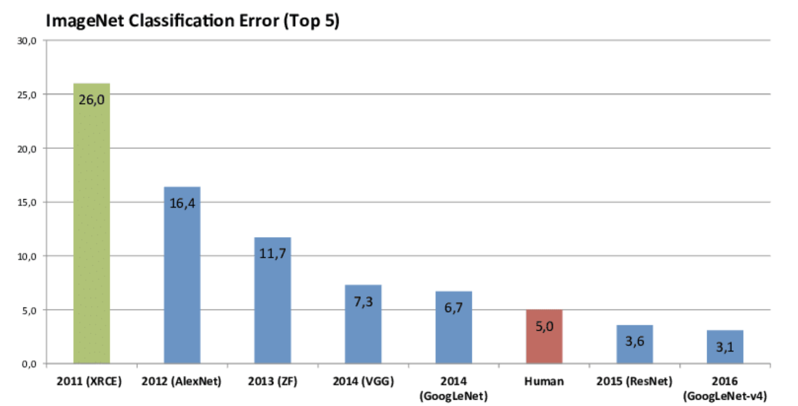
</p>


## Bloques CNN

Los bloques convolucionales son los encargados de extraer patrones bidimensionales de las imágenes.

Los principales parámetros a configurar en los bloques convolucionales son:

- Número de filtros
- Tamaño de los filtros
- Stride
- Padding
- Función de activación


La principal diferencia de esta red con las vistas anteriormente es que las capas van a contener filtros convolucionales en vez de neuronas. Estos filtros convolucionales se van a encargar de extraer patrones de la imagen de entrada.

A la salida de un filtro convolución voy a tener un número de imágenes igual al número de filtros que hay en cada capa.

El tamaño de los filtros del bloque define cuantas files y columnas van a tener los filtros que componen el bloque.

El padding va a definir si se añaden píxeles en los bordes de los mapas de activaciokn para mantener el número de filas y columnas en las que realizar la convolución. El número de píxeles a añadir depende del tamaño de los filtros.

El stride define el número de píxeles que se van a desplazar los filtros en cada convolución. Si el stride es 1, los filtros se desplazan de 1 en 1. Si el stride es 2, los filtros se desplazan de 2 en 2.

La función de activación determina como reacciona una neurona a una determinada entrada. En los bloques convolucionales se suele utilizar ReLU como función de activación.

La fórmula para calcular el output size de la imagen es:

$$output\_size = \frac{input\_size - filter\_size + 2*padding}{stride} + 1$$

El número de padding a añadir depende del tamaño de los filtros. Si el tamaño de los filtros es impar, el número de píxeles a añadir es igual a la mitad del tamaño de los filtros. Si el tamaño de los filtros es par, el número de píxeles a añadir es igual a la mitad del tamaño de los filtros menos 1.

$$padding = \frac{filter\_size - 1}{2}$$

<p align="center">
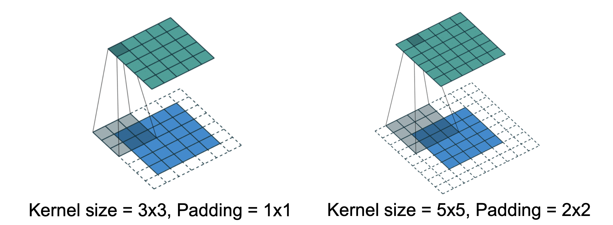
</p>


Los bloques de pooling se utilizan para reducir el tamaño de las imágenes para aumentar la escala de la ifnormaciónq ue van a extraer los bloques convolucionales posteriores. 

Los princiapeles parámetros a configurar en los blouqes convolucionales son:

- Tamaño del pooling
- Stride
- Padding

Los tipos de pooling más habituales son el max pooling y el average pooling.

Generalmente, se configuran los bloques de Pooling con tamaño 2x2 y stride 2 para reducir el tamaño de los mapas de activación a la mitad.

<p align="center">
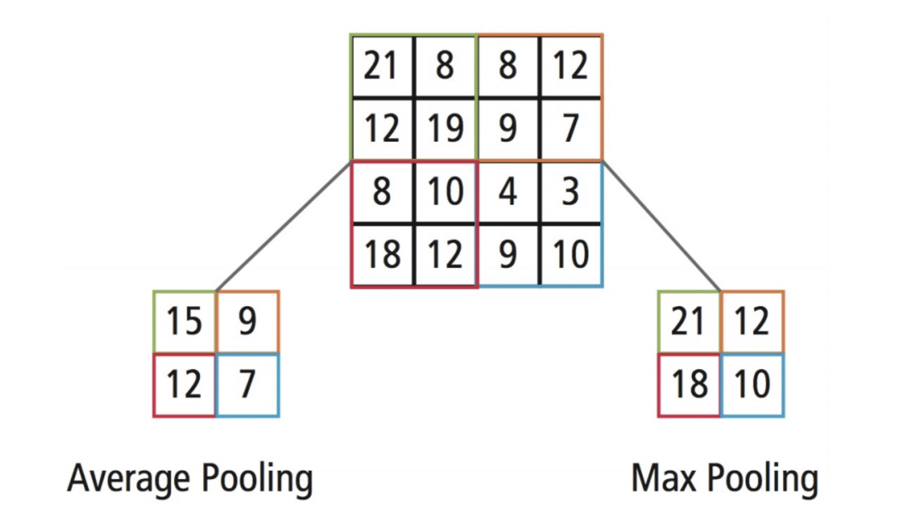
</p>


El bloque flatten se utiliza para convertir los mapas de activación a un vector unidimensional que pueda ser procesado por blooques fully-connected.


Hasta este punto lo que hemos conseguido con nuestra red convolucional es extraer las características más relevantes de una imagen.


Los bloques fully connected son los que componen las redes neuronales tradicionales. Generalmente se utilizan como bloques finales en las CNN. Los principales parámetros a configurar en los bloques convolucionales son:

• Número de neuronas.

• Función de activación.


### Mensaje clave

El uso de CNN ha crecido de forma exponencial desde 2012.


Los principales bloques constituyentes de las CNN son:

- Bloques convolucionales.

- Bloques de pooling.

- Bloque flatten.

- Bloques fully-connected.

Existen una gran variedad adicional de bloques, pero estos pertenecen a dominios concretos, menos generalistas.


<br>

<br>

# Redes Neuronales Convolucionales: Técnicas avanzadas


Las CNN requieren una gran cantidad de datos etiquetados para funcionar de forma apropiada, pero existen ciertas técnicas que permiten reducir considerablemente el número de muestras de entrenamiento manteniendo niveles muy altos de desempeño.

Estas técnicas se basan:

1- La reducción del overfitting.

2- El procesado de los datos en la CNN.

3- La generación de muestras artificiales.

4- La reutilización de pesos obtenidos con otras conjuntos de datos.


## Dropout

El principal objetivo del Dropout es prevenir el sobreajuste de la red. Consiste en desactivar de forma aleatoria neuronas de la red durante la fase de entrenamiento. El porcentaje de neuronas a desactivar es fijado por el desarrollador.

<p align="center">
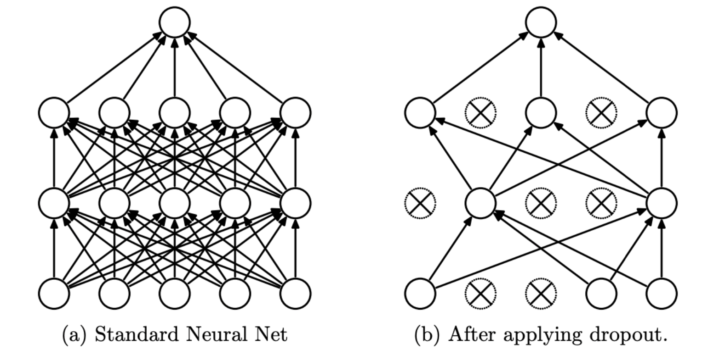
</p>


## Batch Normalization

Es una téncica que permite utilizar Learning Rates más grandes manteniendo la estabilidad de la red. Consiste en normalizar los valores de las activaciones de cada capa a una distribución normal con media 0 y varianza 1.


## Data Augmentation

Permite reducir el sobreajuste a la vez que aumenta el desempeño de la redes neuronales. Esta técnica consiste en la aplicación de transformaciones aleatorias a los datos durante el proceso de entrada. 

<p align="center">

</p>


## Transfer Learning

El Transfer Learning permite reducir significativamente el número de muestras de entrenamiento necesarias para entrenar CNNs.

Esta técnica se basa en la utilización de los pesos de un modelo entrenado con una gran base de datos (habitualmente Imagenet) como estado inicial para posteriormente ajustar estos pesos a la tarea específica que se requiere resolver.

<p align="center">

</p>


### Mensaje clave

Existen una gran variedad de técnicas que permiten reducir el número de muestras de entrenamiento necesarias para entrenar CNNs.

Las principales técnicas son:

- Dropout.
- Batch Normalization.
- Data Augmentation.
- Transfer Learning.


<br>

<br>


------------


## _Clase 26/05/2023_


## Segmentación

La segmentación mediante CNN asigna a cada píxel de una imagen de entrada la probabilidad de formar parte de una clase determinada.

El mapa de probabilidades que genera recibe el nombre de máscara de segmentación.


UNet es una de las arquitecturas más utilizadas para segmentación.  Se caracteriza por tener una fase de compresión basada en bloques convolucionales y maxpooling, y de una fase de expansión formada por bloques convoluciones y bloques de convluciones transpuestas.


El coeficiente de Dice se utiliza como métrica e incluso como función de pérdidas en tareas de segmentación. Se utiliza para evaluar el solapamiento entre dos máscaras de segmentación, donde 1 equivale a un solapamiento perfecto y 0 a la ausencia de solapamiento.

$$Dice = \frac{2*\mathbf{TP}}{2*\mathbf{TP} + \mathbf{FP} + \mathbf{FN}}$$


## Detección de Objetos

La Detección de Objetos consiste en generar una bounding box con una probabilidad de clase asociada por cada objeto que se encuentra en la imagen de entrada.

YOLO (You Only Look Once) fue una de las primeras arquitecturas que consiguió una implementación eficaz y en tiempo real de la detección de objetos. Está compuesta por bloques convolucionales, maxpooling y fully connected.

<p align="center">
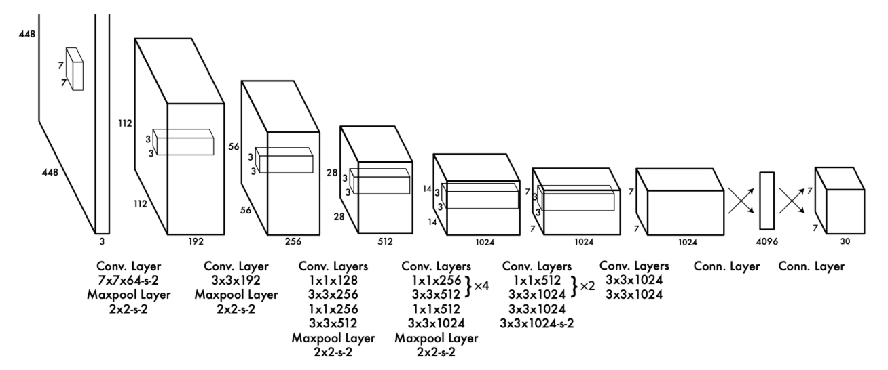
</p>


YOLO afronta la detección de objetos como un problema de diversos parámetros.

La función de pérdidas es una combinación de diversos errores cuadráticos:

- Centro de la bounding box
- Altura y anchura de la bounding box
- "Objetidad" de la bounding box
- Clase de la bounding box


