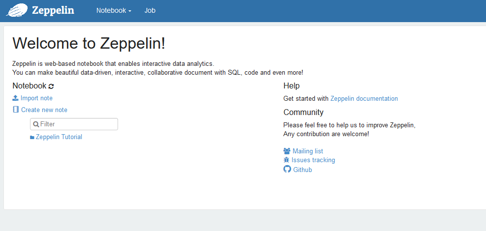

# Get familiar with Notebooks: Zeppelin
# 0 : Start Zeppelin

[](https://zeppelin.apache.org/)


#### Open your Powershell console
Run below command 

```bash
docker version
```
```bash

Client:
 Version:           18.09.7
 API version:       1.39
 Go version:        go1.10.1
 Git commit:        2d0083d
 Built:             Fri Aug 16 14:20:06 2019
 OS/Arch:           linux/amd64
 Experimental:      false

Server:
 Engine:
  Version:          18.09.7
  API version:      1.39 (minimum version 1.12)
  Go version:       go1.10.1
  Git commit:       2d0083d
  Built:            Wed Aug 14 19:41:23 2019
  OS/Arch:          linux/amd64
  Experimental:     false
  
```

#### Once validated download the Zeppelin Docker file
Run below command 
```bash
docker run -p 19999:8080 -v $PWD/data:/zeppelin/data -v $PWD/logs:/logs --rm --name zeppelin_single apache/zeppelin:0.8.1 
```
```bash
0.8.1: Pulling from apache/zeppelin
16c48d79e9cc: Pull complete 
3c654ad3ed7d: Pull complete 
6276f4f9c29d: Pull complete 
a4bd43ad48ce: Pull complete 
09fa44e5c8f4: Pull complete 
d2194c8e9028: Pull complete 
14999b83e6c2: Pull complete 
8bf995f72bf4: Pull complete 
cb1a3c7ca81d: Pull complete 
cfc0133079f0: Pull complete 
ce08f9779ba4: Pull complete 
4a0003e23910: Pull complete 
Digest: sha256:3b7fc0ad29bc7ef4523e8619ff24cc42a7645202cdb76c286d052f6ab8f1c24e
Status: Downloaded newer image for apache/zeppelin:0.8.1
```

#### Validate the image is ready in your docker instance
Run below command 
```bash
docker ps
```
```bash
CONTAINER ID        IMAGE                   COMMAND                  CREATED             STATUS              PORTS                    NAMES
82417ea3f4a7        apache/zeppelin:0.8.1   "/usr/bin/tini -- bi…"   2 minutes ago       Up 2 minutes        0.0.0.0:19999->8080/tcp   zeppelin
```

#### Open your Explorer and go to localhost:19999

[](http://localhost:19999)

