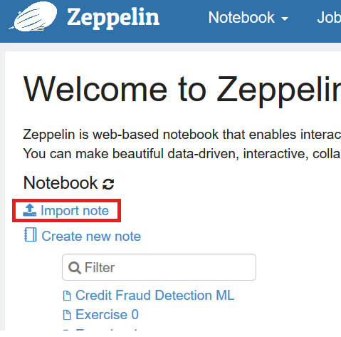
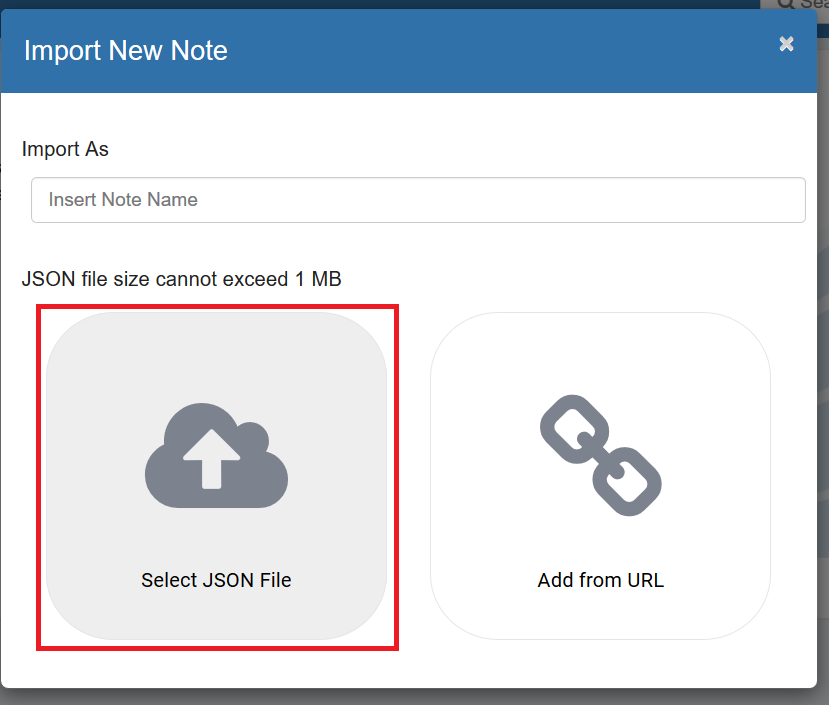
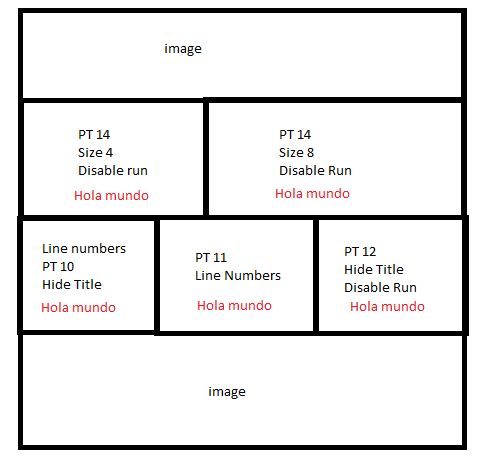

# Session ING-005 Get familiar with Notebooks: Zeppelin
# 1 : Get familiar

[](https://zeppelin.apache.org/)


#### Open your Zeppelin
Run below command 

```bash
http://localhost:19999
```
Once opened, import the notebook present in your folder:

[]

[]

Now we will see different things we can configure inside a notebook what can we configure to adapt to our needs.

# Exercise 1 : 

Create a notebook with the following structure:

[]

