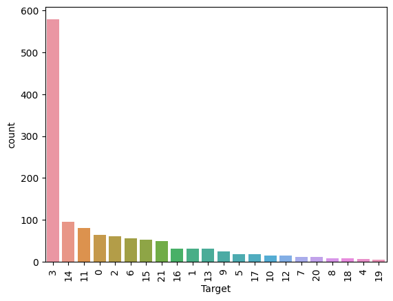

# MASTER DATA  [](https://edem.eu)   2022

En el Máster de [EDEM][edem] sobre Data Analytics, el aprendizaje se estructura en diferentes módulos, cuyo contenido en este repositorio se ha clasificado en las siguientes carpetas:

<br>

| CARPETA | CONTENIDO |
| ------ | ------ |
| [Modulo_0-Fundamentos](Modulo_0-Fundamentos/) | Contiene la parte introductoria del curso. En este primer módulo se aprende sobre lenguajes como Python o Unix, así como el manejo de herramientas como Docker  |
| [Modulo_1-TratamientoDato](Modulo_1-TratamientoDato/) | En este módulo aprendemos los conceptos y programas empleados para el tratamiento de los datos, desde la ingestión de datos hasta su aplicación al negocio |
| [Modulo_2-AplicacionNegocio](Modulo_2-AplicacionNegocio/) | En este módulo aprendemos diferentes ideas sobre como utilizar los datos para potenciar el crecimiento de una empresa |
| [Modulo_3-TransformacionDigital](Modulo_3-TransformacionDigital/) | En este módulo nos enseñan las formas en la que los datos están transformando nuestra sociedad y como cambiará el mundo en las próximas décadas  |
| [Modulo_4-AprendizajeAutomatico](Modulo_4-AprendizajeAutomatico) | En este módulo aprendemos algoritmos de Machine Learning y Deep Learning que se utilizan para sacar el mayor provecho de los datos a través de la IA  |


<br>

Dentro de cada una de las carpetas la organización es la siguiente:

<br>

| ARCHIVO/DIR | CONTENIDO |
| ------ | ------ |
| README.md | Explica la estructura que tiene dicho módulo y como se dividen las diferentes carpetas  |
| NotasClase | Incluye los apuntes tomados sobre teoría general de dicho módulo |
| <lenguaje/software> | Cada carpeta con el nombre de un lenguaje de programación o software que se utiliza durante el Máster |


--------------------------------------------------------------------------------

<br>

A lo largo del Máster también hemos realizado 4 data projects (cada uno en un repositorio individual al que se puede acceder pinchando en el enlace del título) que tratan sobre lo siguiente:

<br>

## [DATA PROJECT 1](https://github.com/mimove/DATAPROJECT1)

<br>

<p align="center">

</p>

### Descripción

El portal lider de compra de vivienda en españa quiere sacar un piloto de calidad de vida aplicado a la vivienda y ha elegido Valencia como sede para su piloto. La idea de este piloto es ofrecer un mapa de calidad de la vivienda en funcion de indicadores de datos abiertos. La calidad de la vivienda se medirá por ruido, hospitales, contaminación… teniendo que dar una nota a una zona en concreto en base a dichos parámetros.

<br>

### Equipo

- [Fan Wu](https://www.linkedin.com/in/fan-wu-98697b13b/): Licenciado en ADE. Encargado de la parte de Business Inteligence y mejora de la aplicación para la incorporación de viviendas a la base de datos a través de Python y POSTRESQL

- [Dario Fernández](https://www.linkedin.com/in/dar%C3%ADo-fern%C3%A1ndez-fern%C3%A1ndez/): Economista. Encargado de la parte de Data Analytics diseñando la encuesta a realizar a los clientes y desarrollando el código para conexión a la API de Google a través de Python

- [Francisco Rosillo](https://www.linkedin.com/in/francisco-rosillo-d%C3%ADez/): Ingeniero de Telecomunicaciones. Parte del equipo de Data Engineering del proyecto. Desarrollo de código Python para carga de base de datos y creación de tablas en POSTGRESQL. También encargado de la parte de Calidad del Dato del proyecto.

- [Miguel Moratilla](https://github.com/mimove): Doctor en Ing. Aeroespacial. Encargado Senior del proyecto. Responsable de la extracción y transformación de los datos desde la web de [open data](https://valencia.opendatasoft.com/pages/home/). Diseño de la arquitectura, y dirección del proyecto distribuyendo tareas entre los componentes del equipo.

<br>

### Diseño de la arquitectura

El proyecto consta de 3 contenedores docker que se encargan de las 3 partes de Data Engineering (ETL) y un cuarto contenedor para realizar un estudio de calidad del dato:

1. Contenedor NiFi (Extracción): el contenedor NiFi se utiliza para la recolección de datos de la web de open data. NiFi se configura a través de un volumen bind mounted en el que se encuentra el flujo que tiene que ser ejecutado automáticamente cuando se levanta el contenedor. Este volumen se está alojado en ./nifi/conf_local. En total se descargan 9 archivos geojson con diferentes datos relativos a la calidad de vida de Valencia. Los archivos son compartidos con el contenedor Python a través de un volumen que se llama nifi_python. Los datos descargados son:

    - Zonas Verdes

    - Distribución de Hospitales

    - Distribución de colegios

    - Nivel de ruido

    - Limpieza

    - Puntos de recarga de coches eléctricos

    - Transporte público


2. Contenedor Python (Transformación): el contenedor Python se encarga de leer los archivos geojson que descarga NiFi, calcular la intersección del geoDataFrame de barrios con todos los geoDataFrame del resto de características, conectarse a la API de Google y calcular los barrios recomendados para los clientes en función de sus respuestas a la encuesta. Una vez hechas todas las transformaciones a los datos, el programa de Python se encarga también de cargar los datos en las tablas de la base de datos SQL. Las funciones creadas se han metido dentro de modulos para tener una estructura más organizada del código. El contenedor tiene 2 volumenes conectados: 

    - nifi_python: Volumen del que recoge los datos descargados por NiFi

    - db_barrios: Volumen en el que escribe el archivo final geojson con las características interpoladas a todos los barrios


3. Contenedor Postgres (Carga): el contenedor Postgres se utiliza como data warehouse para almacenar la base de datos del proyecto. Las tablas se crean desde un archivo .sql en tiempo de construcción del contenedor y son posteriormente alimentadas por Python.


4. Contenedor Jupyter (Calidad del dato): el contenedor docker se conecta a través del volumen db_barrios a python para poder acceder al archivo geojson y realizar un estudio de calidad del dato.

El diagrama con la arquitectura es el siguiente:

<p align="center">

</p>

<br>


Por otro lado, el modelo de datos consta de 6 tablas: Casas, Barrios, Recomendación, Cliente, Barrio_Características y Características, siendo la tabla principal la de Recomendación, ya que es la que unifica la información de los clientes con los barrios que le corresponden para cada característica según el estilo de vida que han respondido en el cuestionario.

<p align="center">

</p>

<br>

### Ejecución del proyecto

Para ejecutar el proyecto simplemente hay que clonar el repositorio y ejecutar*:

```sh
docker compose up
```

Esto levanta todos los contenedores y asigna los volumenes y los puertos a cada uno de ellos. Para ver como funciona el código completo se puede consultar el siguiente video de YouTube:

<https://www.youtube.com/watch?v=w-ZNPGcKnTY&ab_channel=FanWu>


El contenedor NiFi se puede comprobar desde la siguiente dirección:

<http://localhost:8443/nifi>

El contenedor Jupyter se puede comprobar desde la siguiente dirección:

<http://localhost:10000>


Para cargar el archivo en Tableu hay que conectarse a la base de datos con los siguientes campos y abrir el archivo de la carpeta [tableau](./tableau):

| Campo | Texto a completar |
|----------|---------|
| <b>Server Address*</b> | localhost  |
| <b>Port*</b> | 5432  |
| <b>Database*</b> | idealista  |
| <b>Username*</b> | postgres  |
| <b>Password</b> | Welcome01  |


<br>

*El código funciona utilizando la distribución WSL:Ubuntu. Desde Windows existe un problema con el script start.sh de NiFi a la hora de copiarlo al contenedor


<br>


<br>

## [DATA PROJECT 2 (On Premise)](https://github.com/mimove/DATAPROJECT2_ONPREMISE) [^1]


<p align="center">

</p>


<br>

### DESCRIPCIÓN

La empresa de placas solares **SolarMinds Technologies [^2]** ha decidido montar una infraestructura de gestión de los datos que cada placa individual genera para poder estimar la producción total de energía, así como monitorizar el estado de cada placa solar para facilitar las tareas de mantenimiento. En principio, dicha empresa tiene en su sede central montados y funcionados una serie de servidores que le gustaría utilizar para este proyecto. Nuestro objetivo como consultores es, primero facilitarles una herramienta E2E on premise que puedan usar para sacar la mayor cantidad de información valiosa posible pero, por otro lado, queremos enseñarles también las ventajas que supondría tener este software en el Cloud. 


<br>

### Equipo

- [Elyca Jardín](https://www.linkedin.com/in/elycajardin/): Máster en Ingeniería Marítima. Encargada de la parte de Business Inteligence y Data Analytics utlizando Grafana Cloud y Looker Data Studio

- [Pablo Martínez](https://github.com/Pablomartiver): Economista. Encargado de la parte de Data Engineering relativa a la cola de mensajes en Pub/Sub y Kafka (On premise)

- [Jorge Martínez](https://github.com/joorgemartinez): Licenciado en International Business. Parte del equipo de Data Engineering del proyecto. Desarrollo de código Python para Dataflow y Cloud Functions así como de Spark (On premise)

- [Miguel Moratilla](https://github.com/mimove): Doctor en Ing. Aeroespacial. Encargado Senior del proyecto. Responsable de la generación de los datos y la parte DevOps del proyecto. Diseño de la arquitectura, y dirección del proyecto distribuyendo tareas entre los componentes del equipo.

<br>

En este repositorio, se encuentra la solución On premise que hemos diseñado. Consta de las siguientes partes:

1. Generador de datos con envío a Kafka

2. Spark streaming para transformación de los mensajes

3. MySQL como almacenamiento

4. Grafana para visualización

5. Flask para generar una API de consulta de datos a la BD

Todo ello se encuentra dentro de un Docker compose. Para ejecutar el docker compose up hay que tener en cuenta 2 cosas:

1. Dentro del archivo de variables de entorno .env se puede configurar lo siguiente:

    ```s
    CONTAINERS=4 #Numero de paneles solares máximo a crear
    PROBABILIDAD=10 #Probabilidad de que un panel se apague
    TIME=5 #Delay entre datos de los paneles
    IMAGE=solar_gen_premise #Nombre de la imagen de docker de cada panel
    TOPIC=panelInfo #Nombre del topico en Kafka
    ```

2. Una vez configurado el archivo de variables de entorno, se puede ejecutar ```docker-compose up -d``` para activar la aplicación.


<br>


### Diseño de Arquitectura

En la siguiente imagen se puede ver el diseño de arquitectura seguido:

<p align="center">

</p>

<br>

### Generador de datos (KAFKA)

Para simular el comportamiento de un placa solar, se ha optado por utilizar una ecuación basada en la secante hiperbólica, cuya distribución es muy similar a una distribución normal. La ecuación utilizada es:

$$\mathrm{P}=\frac{\mathrm{P_{max}}}{\cosh((t-t_{ini})*C-t_{ini})^{C}}$$


Donde $\mathrm{P_{max}}$ es la potencia máxima del panel, $t_{ini}$ la hora a la que empieza a generar energía, y $C$ es una constante que se utiliza para modificar el ancho de la curva.

La siguiente figura muestra como se vería la curva para una placa solar que produjera durante una hora, con un máximo de potencia de 400W:

<p align="center">

</p>


Con esta ecuación, el generador de datos lo que simula es una serie de contenedores Docker, siendo cada contenedor una placa solar individual, que tiene una probabilidad dada cada n segundos de estar produciendo energía o no.

Estos contenedores, envían información a un tópico de los brokers de Kafka. En total, está configuración cuenta con 2 Brokers para estar diseñada con tolerancia a fallos. Si uno de los 2 brokers se apaga, el otro sigue funcionando y la aplicación no daría ningún fallo.

<br>

### SPARK

Dentro de la carpeta de pyspark, se encuentra el código Python escrito utilizando la librería Spark Streaming para consumir los datos generados por los paneles solares mediante una subscripción al tópico de Kafka. En Spark se realizan los siguientes pasos:

1. Primero se leen los mensajes escritos en formato JSON que se encuentran en el tópico, creando un Dataframe con el contenido de los mensajes.

2. Los datos recibidos se guardan en una tabla de MySQL  que tiene el siguiente schema:

    ```sql
    CREATE TABLE IF NOT EXISTS panelData (
    Panel_id varchar(250) NOT NULL,
    power_panel DECIMAL(20,3) NOT NULL,
    current_status INT NOT NULL,
    time_data TIMESTAMP
    );
    ```


3. Se calcula una ventana para sacar en franjas de 30 segundos la potencia media generada por los paneles, y se escribe el resultado de la transformación en otra tabla de MySQL.

Una diferencia importante con respecto a la arquitectura de Cloud, es que Spark streaming no es 100% en streaming, si no que funciona mediante la creación de microbatches que luegos son volcados con la clase ```writeStream``` a la base de datos


Para ejecutar este código se puede hacer de 2 formas:

1. Ejecutando el siguiente comando desde la terminal:

    ```sh
    docker exec dataproject2_onpremise-spark-master-1 \
                /spark/bin/spark-submit \
                --master spark://spark-master:7077 \
                --jars /opt/spark-apps/mysql-connector-java-8.0.13.jar \
                --packages org.apache.spark:spark-sql-kafka-0-10_2.12:3.0.2 \
                --driver-memory 1G \
                --executor-memory 1G \
                --conf "spark.worker.instances=2" \
                /opt/spark-apps/main.py
    ```

2. Ejecutando el script ./run.sh que se encuentra dentro de la carpeta


<br>

### API EN FLASK

Se ha construido una API en Flask que, mediante una consulta con un ID concreto de una placa, devuelve todos los registros de esa placa en concreto para poder trabajar con ellos desde otra aplicación. En la siguiente imagen se ve un ejemplo de la llamada a la API:


<p align="center">

</p>


<br>

### GRAFANA CLOUD

En la parte de visualización, se ha creado un dashboard que se muestra en la siguiente imagen para un ejemplo con 30 placas solares:


<p align="center">

</p>


<br>

[^1]: El proyecto también se ha desarrollado en Cloud y se puede ver en el siguiente [link](https://github.com/mimove/DATAPROJECT2)

[^2]: Logo y nombre creados con la inteligencia artificial [Dall·E 2](https://openai.com/dall-e-2/) y ChatGPT respectivamente.


<br>


<br>

## [DATA PROJECT 3](https://github.com/mimove/DATAPROJECT3)

## Detección de Enfermedad Cardíaca

Este proyecto de datos tiene como objetivo la detección de enfermedad cardiaca mediante el análisis de un conjunto de datos que contiene información sobremúltiples pacientes con diferentes grados de enfermedad o ausencia de la misma.

Esta tarea parece sencilla, sin embargo, debemos ser conscientes de la importancia de proporcionar una solución a este tipo de problemas y el gran avance que supone en la práctica clínica. La detección temprana de enfermedades cardiovasculares en el momento del ingreso o la consulta médica puede salvar o mejorar la calidad de vida de los pacientes, por ello, desarrollar modelos precisos y eficientes puede ayudar a los profesionales médicos en la toma de decisiones clínicas y en la personalización de los tratamientos.

Este desafío consiste en entrenar un modelo de aprendizaje automático que pueda predecir la presencia de enfermedad en el corazón basándose en las características recogidas en diferentes pruebas médicas como variables clínicas.

## Descripción del dataset

### Etiquetas

El conjunto de datos se proporciona en formato CSV y contiene información sobre 866 pacientes con diferentes grados de enfermedad (1-4) o ausencia de la misma (0). Este dato puede obtenerse de la columna 'label'

### Características

Además, el conjunto de datos está compuesto por 13 características adicionales que describen las condiciones de salud de cada uno de los pacientes. Estas características se describen a continuación:

```
1. age: edad del paciente       
  2. sex: sexo del paciente       
  3. cp: tipo de dolor de pecho:
                1: angina típica
                2: angina atípica
                3: dolor no-anginoso
                4: asintomático
  4. trestbps: presión arterial en reposo (en mm Hg al ingreso en el hospital)
  5. chol: colesterol sérico en mg/dl
  6. fbs: nivel de azúcar en ayunas > 120 mg/dl  (1 = verdadero; 0 = falso)
  7. restecg: resultados electrocardiográficos en reposo
                         0: normal
                         1: presenta anormalidad de la onda ST-T (inversiones de la onda T y/o elevación o depresión del 
                             ST elevación o depresión del ST > 0,05 mV)
                         2: presenta probable o definida hipertrofia ventricular izquierda
  8. thalach: frecuencia cardiaca máxima
  9. exang: angina inducida por el ejercicio (1 = sí; 0 = no)
  10. oldpeak: depresión del ST inducida por el ejercicio en relación con el reposo
  11. slope: la pendiente del segmento ST en ejercicio máximo
                        1: pendiente ascendente
                        2: plano
                        3: pendiente descendente
  12. ca: número de vasos mayores (0-3) coloreados por flouroscopia      
  13. thal: 3 = normal
                6 = defecto fijo 
                7 = defecto reversible

```

## Equipo

- [Julio Sahuquillo](https://www.linkedin.com/in/juliosahuquillohuerta/): Ingeniero en Organización Industrial.


- [Dario Fernández](https://www.linkedin.com/in/dar%C3%ADo-fern%C3%A1ndez-fern%C3%A1ndez/): Economista. 

- [Miguel Moratilla](https://github.com/mimove): Doctor en Ing. Aeroespacial. 


## Split

La columna "split" identifica si esa muestra pertenece al conjunto de entrenamiento 'train' o de validación 'val'.


<br>

<br>

**Nota:** Los siguientes apartados son un resumen de las notas que se pueden ver en los notebooks de las carpetas CasoA y CasoB.

<br>

## Data Cleaning y Análisis

El data set consta de:

- 866 registros
- 14 variables y una columna con si la muestra corresponde al set de entrenamiento o al de validación. La variable a predecir es la columna "label".

Aunque muchas variables aparecen como float64 al hacer un dtypes, las variables se pueden clasificar en numéricas y categóricas según la siguiente lista:

Variables categóricas:

- sex (sexo del paciente)
- cp (tipo de dolor de pecho)
- fbs ((nivel de azúcar en ayunas > 120 mg/dl)  (1 = verdadero; 0 = falso))
- restecg (resultados electrocardiográficos en reposo)
- exang (angina inducida por el ejercicio)
- slope (la pendiente del segmento ST en ejercicio máximo)
- ca (número de vasos mayores coloreados por flouroscopia)
- thal (tipo de defecto)
- label (variable de clasificación, no mencionada en la lista inicial)
- split (variable de división de datos, no mencionada en la lista inicial)


Variables numéricas:

- age (edad del paciente)
- trestbps (presión arterial en reposo)
- chol (colesterol sérico)
- thalach (frecuencia cardiaca en máxima capacidad)
- oldpeak (depresión del ST inducida por el ejercicio en relación con el reposo)


Al hacer un describe y agrupar por clases, las clases definidas por 'label' están desbalanceadas, ya que hay más casos de la clase 0 que del resto de clases, y muy pocos casos de la clase 4.


### Missing values y valores erróneos

A primera vista se ve como hay gran cantidad de valores no informados en las variables slope, ca y thal. También se ve como la variable chol (colesterol) tiene 159 valores nulos, lo cuál no puede ser ya que el colesterol no puede ser nulo.


### Matriz de correlación

A través de la matriz de correlación, podemos ver como para las variables cp, thalach, exang, oldpeak, slope, ca y thal, la correlación es mayor que para el resto de variables


## Descripción CasoA y CasoB

A partir de esta información inicial obtenida del análisis preliminar de los datos, se planteo el estudio de 2 casos diferentes:

### CasoA

En este caso, se plantea un estudio eliminando aquellas variables que resultan problemáticas, como son todas aquellas en las que hay gran cantidad de valores nulos, y aquellas que tienen valores erróneos. Por lo tanto, las variables con las que nos quedamos fueron:

- Age
- Sex
- Cp
- tresbps
- fbs
- restecg
- thalach
- exang
- oldpeak

Al hacer esto, también se eliminan aquellas variables con mayor correlación con la variable 'label'. Esto hizo que obtuvieramos una mejor puntación según el f1_score en el dataset público, ya que los profesores nos dijeron que, a pesar del que dataset de training y validacióne estaba desbalanceado, el dataset de test en el ranking publico estaba balanceado. El F1-score máximo que obtuvimos en el ranking público fue de 0.5742 con un modelo de Random Forest, mientras que en el privado fue de 0.3333.

### CasoB

En este caso, se plantea un estudio en el se cogen aquellas variables con mayor correlación con la categoría label, rellenando los valores nulos y erróneos de las variables problemáticas. Para ello, se han utilizado diferentes técnicas para predecir los valores nulos y erróneos de las variables 'chol', 'slope', 'ca' y 'thal'. Las variables de este segundo caso por tanto son:

- Age
- Sex
- cp
- thalach
- exang
- oldpeak
- slope
- ca
- thal

Al tener las variables con mayor correlación con 'label' era de esperar que obtuvieramos una menor puntuación en el ranking público, cuyo dataset de test estaba balanceado. Sin embargo, al volver a tomar una pequeña muestra aleatoria de test solo con el 30% de los datos para el ranking privado, podíamos suponer que dicho ranking iba a volver a estar desbalanceado. El F1-score máximo que obtuvimos fue de 0.54285 con un modelo de Random Forest en el ranking público, mientras que en el privado fue de 0.46666.


<br>


<br>

## [DATA PROJECT 4](https://github.com/mimove/DATAPROJECT4)

<p align="center">

</p>

En este caso el reto consiste en que afrontéis una competición Kaggle donde vosotros pelearéis por la nota más alta. En este caso vamos a decidir que vuestra capacidad técnica sea la que os evalúe de una manera completamente objetiva.

De cara a realizar este reto, debéis descargaros el dataset que hay adjunto y realizar la predicción de las imágenes catalogadas dentro del dataset de test.

Estos archivos son imágenes radiológicas por lo que vuestro trabajo será entrenar un modelo predictivo capaz de determinar qué parte del cuerpo ha sido radiografiada. Clasificar una parte del cuerpo a partir de una imagen de rayos X puede parecer algo trivial, pero tenerlo automatizado puede ser clave para todo el sector del aprendizaje profundo en imágenes médicas. En muchos hospitales, cuando un médico solicita múltiples adquisiciones de imágenes, se crea un número de acceso para cada parte del cuerpo (p. ej., rodilla, tobillo y pierna), pero el registro de las imágenes correspondientes suele ser incorrecto dentro de cada número de acceso.

El registro incorrecto de partes del cuerpo en radiografías es un problema relevante, ya que si, por ejemplo, se desea extraer un dataset de rodilla utilizando el filtrado de PACS (base de datos donde se almacenan las imágenes medicas en un hospital) mediante la descripción del estudio, a menudo se extraerán imágenes con varias partes del cuerpo. Además, si se crea un modelo para clasificar enfermedades en alguna parte del cuerpo específica, la implementación del modelo en la práctica clínica será casi imposible. Por un lado, imagina que se crea un modelo para detectar neumonía en radiografías de tórax. Para implementar ese modelo, debemos asegurarnos de obtener solo radiografías de tórax. De lo contrario, podemos terminar tratando de diagnosticar una neumonía a partir de una radiografía de cráneo, lo que no tiene ningún sentido.


Recursos útiles

- Pydicom - A extremely useful library in Python that helps you handle DICOM format files. - https://pydicom.github.io/
  
- DICOM - The DICOM website can have multiple information on DICOM metadata and how it can affect the display of an image(eg. PhotometricInterpretation TAG) - https://www.dicomstandard.org/


## Dataset Description

### ¿Qué archivos necesito?

Necesitarás descargar una copia de las imágenes. Encontrarás dos directorios (train y test) que contienen archivos DICOM anonimizados.

También necesitarás las etiquetas de entrenamiento de train.csv y los nombres de los archivos del conjunto de test de sample_submission.csv.

### ¿Cuál es el formato de los datos?

Los datos de entrenamiento se proporcionan como un conjunto de SOPInstanceUIDs y sus etiquetas en csv. Las etiquetas se definen como una columna Target que contiene enteros que se asignan a diferentes partes del cuerpo.

### Imágenes DICOM

Todas las imágenes proporcionadas están en formato DICOM.

### ¿Qué estoy prediciendo?

En este desafío, los competidores deben predecir la parte del cuerpo a partir de una radiografía.

Debe haber una columna de predicción por imagen, y las etiquetas se representan como números enteros que corresponden cada uno a una parte del cuerpo contenida en el conjunto de datos:

<p align="center">


- Abdomen = 0

- Tobillo = 1

- Columna cervical = 2

- Tórax = 3

- Clavículas = 4

- Codo = 5

- Pies = 6

- Dedos = 7

- Antebrazo = 8

- Mano = 9

- Cadera = 10

- Rodilla = 11

- Pierna = 12

- Columna lumbar = 13

- Otros = 14

- Pelvis = 15

- Hombro = 16

- Senos paranasales = 17

- Cráneo = 18

- Muslo = 19

- Columna torácica = 20

- Muñeca = 21

Nota - Otros indica si la muestra contiene imágenes no radiográficas que a veces se colocan erróneamente en el sistema PACS como radiografías (por ejemplo, esofagograma, densitometría).

### Archivos

train.csv - el conjunto de entrenamiento. Contiene el SOPInstanceUID y la información del objetivo.

sample_submission.csv - un archivo de presentación de muestras en el formato correcto. Contiene SOPInstanceUID para el conjunto de test.

### Columnas

SOPInstanceUID - Cada SOPInstanceUID corresponde a una imagen única.

Target - La etiqueta asignada a cada muestra.


<br>

<br>

## Preparación del entorno de trabajo

Para poder realizar este proyecto, es necesario ejecutar el .ipynb en un entorno de trabajo que disponga de una GPU sufiencientemente potente para poder entrenar el modelo. En este caso, se ha utilizado Google Colab, que es un entorno de trabajo gratuito que nos permite ejecutar el .ipynb en la nube, con una GPU de forma gratuita. También se puede optar por usar Colab Pro, que es de pago, pero que nos permite usar una GPU más potente y durante más tiempo.

## Conversion archivos DCIM a JPG

Para poder trabajar con las imágenes, es necesario convertir los archivos DCIM a JPG. Para ello, se ha utilizado la librería pydicom, que nos permite leer los archivos DCIM y convertirlos a JPG. Además, y como se puede ver en el notebook [DP4.ipynb](DP4.ipynb), se ha reducido el tamaño a una anchura de 512 manteniendo la relación de aspecto. También, se organizan las imagenes en diferentes carpetas en función de la parte del cuerpo que se está radiografiando.

Algunos ejemplos de las imágenes que se obtienen son:

<p align="center">

</p>

## Entrenamiento del modelo

Para entrenar el modelo, se ha utilizado la librería fastai, que nos permite entrenar modelos de forma sencilla. En este caso, se ha utilizado un modelo de transferencia de aprendizaje, que nos permite utilizar un modelo ya entrenado y adaptarlo a nuestro problema. En este caso, la estrategia que mejor resultado ha dado ha sido la de hacer un ensemble de los modelos densenet169, densenet201 y densenet161, ya que cada uno de ellos, al tener una profundidad de capas ocultas diferentes, es capaz de centrarse en diferentes niveles de detalle de las imágenes a entrar. Además, al incluir la conexión del residuio de cada capa convulucional entre sí, se evita el problema del desvanecimiento del gradiente, haciendo posible entrenar redes neuronales muy profundas.

También se han usado técnicas de data augmentation ya que, como se puede ver en el siguiente gráfico, existe un gran desbalance entre la clase 3 y el resto de clases. 

<p align="center">

</p>


### Learning rate

Para encontrar el learning rate óptimo, se ha utilizado la función lr_find() de fastai, que nos permite encontrar el learning rate óptimo para entrenar el modelo. A continuación se muestra la imagen con los 4 learning rates que nos devuelve la función:

<p align="center">

</p>

De entre los 4 learning rates, se ha elegido el valley, ya que es el que nos devuelve un compromiso entre la velocidad de aprendizaje y la estabilidad del modelo durante el entrenamiento.

### Entrenamiento

Durante las 15 epochs (con batch size = 8) en las que se entrena el modelo, se calcula el train loss y el validation loss. En el siguiente gráfico se puede ver la evolución de ambos para uno de los 3 modelos utilizados en el ensemble:

<p align="center">

</p>


### Resultados

Tras entrenar el modelo, se obtiene la siguiente gráfica con los resultados obtenidos en el conjunto de validación:

<p align="center">

</p>


En la siguiente imagen, se resumen los resultados obtenidos para accuracy con todas las pruebas que se han efectuado en este DP:

<p align="center">

</p>

<br>


[//]: # (These are reference links used in the body of this note and get stripped out when the markdown processor does its job.)

[edem]: <https://edem.eu>

